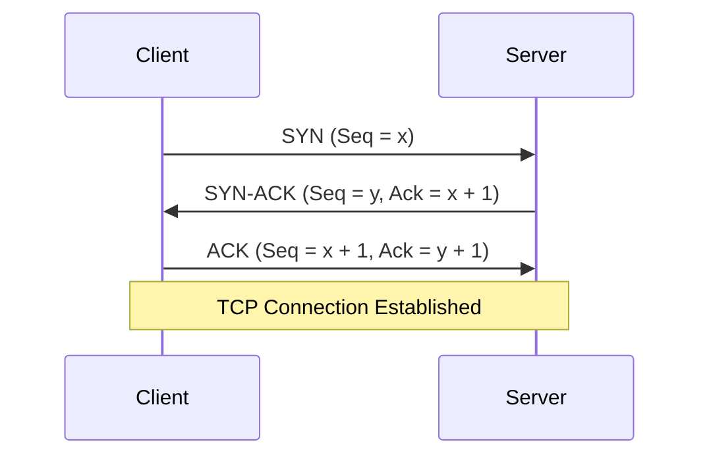
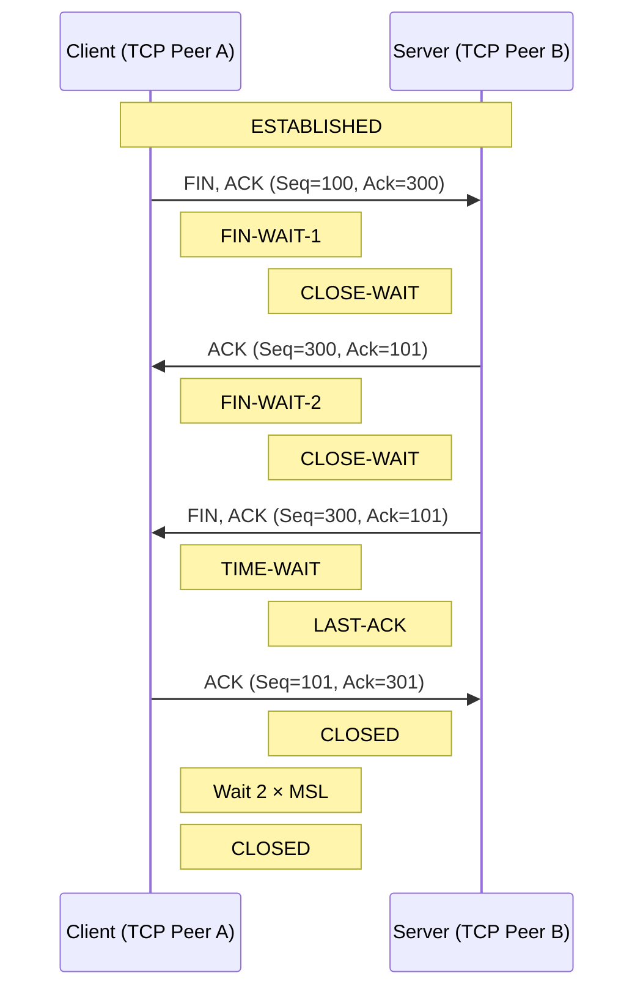

## 학습 목표

- OSI 모델과 TCP/IP 모델의 계층별 역할을 설명할 수 있다.
- TCP와 UDP의 차이와 사용 사례를 설명할 수 있다.
- TCP가 순서 보장, 오류 감지, 재전송으로 신뢰성을 보장하는 방식을 설명할 수 있다.
- TCP 연결 생성과 종료 과정을 설명할 수 있다.
- TIME_WAIT이 필요한 이유를 설명할 수 있다.
- 흐름 제어와 혼잡 제어의 차이를 설명할 수 있다.
- Subnet, Gateway, ARP, Routing, NAT가 IP 패킷 전달에 관여하는 과정을 설명할 수 있다.
- 하나의 TCP 연결이 생성되고 종료되는 전체 흐름을 설명할 수 있다.

## OSI / TCP-IP 계층 개념

<!-- OSI 7계층과 TCP/IP 모델의 계층별 역할을 비교하고, IP와 TCP/UDP가 어느 계층에서 동작하는지 설명한다. -->

Open Systems Interconnection(OSI) 모델의 계층은 소프트웨어 및 하드웨어 구성 요소 전반에 걸쳐 모든 유형의 네트워크 통신을 캡슐화하고, 표준화 인터페이스 & 프로토콜로 통신할 수 있도록 설계되었다.

### OSI 7계층

7. 애플리케이션 계층
- 사용자의 데이터와 **직접 상호 작용**하는 유일한 계층
- 웹 브라우저 및 이메일 클라이언트 등이 이에 의존한다.
- 소프트웨어가 사용자에게 의미 있는 데이터를 제공하기 위해 의존하는 프로토콜과 데이터를 조작하는 역할
- Example: HTTP, SMTP

6. 프레젠테이션 계층: 암호화, 압축, 번역
- 주로 데이터를 준비하는 역할을 하여 애플리케이션 계층이 이를 사용할 수 있게 한다.
- 송수신 장치가 서로 다른 인코딩 방법, 암호화 연결을 사용하는 경우 수신(Application Layer) 장치가 이해할수 있도록 번역/디코딩해주는 역할
- Application Layer에서 수신한 데이터를 Session Layer로 전송하기 전에 압축

5. 세션 계층: 통신 세션
- 세션: 통신이 시작될 때부터 종료될 때까지의 시간
- 두 기기 사이의 통신을 시작하고 종료하는 일을 담당하는 계층
- 데이터 전송을 체크포인트와 동기화하며 체크 포인트가 없으면 전체 전송을 처음부터 재시작한다.

4. 전송 계층: 세그먼트, 전송, 리어셈블리
- 세그먼트으로 분할
- 흐름 제어: 연결 속도가 빠른 송신자가 연결 속도가 느린 수신자를 압도하지 않도록 최적의 전송 속도를 결정한다.
- 전송 계층은 수신된 데이터가 완료되었는지 확인하고 수신되지 않은 경우 재전송을 요청하여 최종 수신자에 대해 오류 제어를 수행한다.
- Example: TCP, UDP

3. 네트워크 계층: 패킷 생성, 전송, 패킷 어셈블리
- 서로 다른 두 네트워크 간 데이터 전송을 용이하게 하는 역할이다.
- 전송 계층의 세그먼트를 송신자의 장치에서 패킷 단위로 세분화하고, 수신 장치에서 패킷을 재조립한다.
- 라우팅: 데이터가 표적에 도달하기 위한 최상의 물리적 경로 탐색
- Examples: IP, 인터넷 제어 메시지 프로토콜(ICMP), 인터넷 그룹 메시지 프로토콜(IGMP), IPsec

2. 데이터 연결 계층: 프레임 생성, 네트워크 간에 전송되는 프레임
- 동일한 네트워크에 있는 두 개의 장치 간 데이터 전송
- 네트워크 계층에서 패킷을 가져와 프레임으로 세분화한다.
- 네트워크 통신에서 흐름 제어 및 오류 제어를 담당한다.

1. 물리적 계층: 전송 케이블, 비트스트림, 수신 케이블
- 케이블, 스위치 등 데이터 전송과 관련된 물리적 장비가 여기에 속한다.
- 1과 0의 문자열인 비트 스트림으로 변환되는 계층이다.

## TCP와 UDP

TCP와 UDP는 모두 네트워크 기본 계층 구조(OSI7 or TCP/IP 모델)의 Transport Layer에서 사용되는 통신 프로토콜이며, 프로그램이 다른 호스트의 어플리케이션 및 메시지를 송신/수신할 수 있게 한다. 

### TCP : Transmission Control Protocol

<!-- TCP가 checksum, sequence/acknowledgement number, timeout, 재전송으로 오류를 감지하고 순서를 보장하는 과정을 설명한다. -->

- **신뢰성**을 가지는 **연결 stream을 기반**으로, **순서를 보장**하는 프로토콜이다. 
  - 재전송 O
- 데이터 Flow가 양방향으로 일어날 수 있다. (방향은 선택사항)
- 기본적으로 신뢰성을 보장하려 하는 특징이 있고, 이를 위해 Congestion Control & Flow Control 이 사용된다. (모두 *Control* 을 위해 사용한다)
- port 번호를 사용해 호스트 내 통신 endpoint(Application)를 식별한다.
- 기본적으로는 Unicast만 지원한다.
- Example: FTP(20/21), Telnet(23), rcp(remote copy)...

- TCP checksum을 통해 전송 중 데이터 손상을 검출한다.
- 각 데이터 바이트에 sequence number를 부여하여 데이터의 순서를 식별하고 중복 데이터를 판별한다.
- acknowledgement number를 통해 수신 완료된 데이터와 다음으로 필요한 데이터를 확인한다.
- 데이터가 손실된 경우 ACK와 재전송 타이머 등을 기반으로 필요한 세그먼트를 재전송한다.

#### TCP 연결 생성: 3-way Handshake

<!-- SYN, SYN-ACK, ACK의 흐름과 각 단계의 시퀀스 번호 변화를 설명한다. -->

1. 클라이언트(host 1)에서 서버(host 2)로 TCP SYNchronize(SYN) 패킷을 보낸다.
2. 서버가 SYN 패킷을 수신하고 SYNchronize-ACKnowledgement(SYN-ACK) 패킷을 보낸다.
3. 클라이언트에서 SYN-ACK 패킷을 수신한 뒤 서버로 ACK 패킷을 보낸다. 서버가 ACK 패킷을 수신하면 연결이 성립된다.

- sequence number: 해당 TCP 세그먼트의 첫 번째 데이터 바이트가 바이트 스트림에서 가지는 번호
- acknowledgement number: 수신자가 다음으로 받기를 기대하는 sequence number. 해당 번호 이전의 모든 바이트를 수신했음을 의미한다.

#### TCP 연결 종료: 4-way Handshake

<!-- FIN과 ACK의 흐름, half-close가 가능한 이유를 설명한다. -->

1. 클라이언트(host 1)가 서버(host 2)로 FIN 패킷을 보내 연결 종료를 요청한다.
   - 클라이언트는 `FIN-WAIT-1` 상태로 진입한다.
2. 서버가 FIN을 수신하고 클라이언트에게 ACK 패킷을 보낸다.
   - 서버는 `CLOSE-WAIT` 상태로 진입한다.
   - ACK를 수신한 클라이언트는 `FIN-WAIT-2` 상태로 진입한다.
   - 이 시점부터 클라이언트로부터 서버 방향의 전송은 종료되지만, 서버로부터 클라이언트 방향의 데이터 전송은 가능하다(half-close).
3. 서버 측 애플리케이션도 연결 종료를 요청하면 서버가 클라이언트에게 FIN 패킷을 보낸다.
   - 서버는 `LAST-ACK` 상태로 진입한다.
4. 클라이언트가 FIN을 수신하고 서버로 ACK 패킷을 보낸다.
   - 서버는 ACK를 수신하면 `CLOSED` 상태가 된다.
   - 클라이언트는 `TIME-WAIT` 상태에서 2 × MSL(Maximum Segment Lifetime) 동안 대기한 뒤 `CLOSED` 상태가 된다.

- TIME-WAIT 하는 이유
  1. 마지막 ACK가 유실됐을 때 재전송
    - A가 B의 FIN을 받고 마지막 ACK를 보냈을 때, ACK가 유실되는 경우 B가 FIN을 재전송한다.
    - A가 바로 CLOSED로 사라지지 않고 TIME-WAIT에 남아 있어야 그 FIN을 받고 ACK를 다시 보낼 수 있음.
  2. 이전 연결에서 늦게 도착한 중복 세그먼트가 새 연결에 섞이는 것을 막기 위해
    - 동일 IP/Port 조합으로 새 TCP 연결을 바로 만드는 경우, 이전 연결의 오래된 세그먼트가 새 연결의 패킷으로 오인될 위험이 있다.
    - 2 × MSL 동안 기다려 이전 연결의 세그먼트가 네트워크에서 사라질 시간을 확보한다.

| 구분      | 흐름 제어      | 혼잡 제어          |
| --------- | -------------- | ------------------ |
| 보호 대상 | 수신 측        | 네트워크           |
| 주요 기준 | 수신 버퍼 여유 | 네트워크 혼잡 상태 |

#### 흐름 제어

<!-- 수신 측 처리 속도에 맞추는 목적과 receive window를 설명한다. -->

TCP 흐름 제어는 송신자가 수신자의 처리 능력보다 많은 데이터를 전송하여 수신 버퍼가 넘치는 것을 방지한다.

- 수신자는 ACK를 전송할 때 TCP 헤더의 Window 필드를 통해 현재 수신할 수 있는 데이터 범위인 receive window(rwnd)를 알린다.
- 송신자는 아직 ACK를 받지 못한 데이터가 rwnd를 초과하지 않도록 sliding window 방식으로 전송량을 제한한다.
- 데이터가 ACK되면 송신 윈도우의 왼쪽 경계가 이동하면서 새로운 데이터를 전송할 수 있게 된다.
- 수신자는 원칙적으로 이미 송신이 허용된 데이터가 윈도우 밖으로 밀려나도록 윈도우의 오른쪽 경계를 축소하지 않아야 한다. 단, 송신자는 축소에도 대응해야 한다.
- 수신 윈도우가 0이 되면 송신자는 새로운 데이터 전송을 중단하고, zero-window probe를 통해 윈도우가 다시 열렸는지 주기적으로 확인한다.

#### 혼잡 제어

<!-- 네트워크 혼잡을 제어하는 목적과 congestion window의 역할을 설명한다. -->

TCP 혼잡 제어는 송신자가 네트워크의 처리 용량보다 많은 데이터를 전송하여 네트워크 혼잡이 악화되는 것을 방지한다.

TCP 송신자는 slow start와 congestion avoidance를 사용하여 전송량을 제어하며, 패킷 손실 시 fast retransmit과 fast recovery를 수행할 수 있다. 재전송 타이머가 만료되면 RTO에 exponential backoff를 적용한다.

>[!note] 혼잡 제어 내에서 사용하는 변수
> - congestion window(cwnd): ACK를 받기 전에 네트워크에 전송할 수 있는 데이터량의 송신 측 한도
> - slow start threshold(ssthresh): slow start와 congestion avoidance를 구분하는 기준
> - FlightSize: 전송되었지만 아직 누적 ACK를 받지 못한 데이터량
> - SMSS: 송신자가 전송할 수 있는 최대 TCP 세그먼트 데이터 크기
>

- Slow Start :
    - 일반적으로 cwnd < ssthresh일 때 사용한다.
    - 패킷 전송에 필요한 네트워크 경로의 가용 용량을 점진적으로 탐색한다.
    - 새 데이터를 확인하는 ACK마다 cwnd를 최대 1 SMSS씩 증가시킨다.
    - ACK가 각 세그먼트마다 도착한다고 가정하면 cwnd는 RTT마다 대략 두 배로 증가한다.
    - cwnd가 ssthresh에 도달하거나 이를 초과하면 congestion avoidance로 전환한다.

- Congestion Avoidance :
    - cwnd를 RTT당 약 1 SMSS씩 선형적으로 증가시키고 혼잡이 감지될 때까지 additive increase를 수행한다.

- Retransmission Timeout :
    - 재전송 타이머가 만료되면 네트워크 혼잡이 심한 것으로 판단해 이를 수행한다.
    - 손실된 세그먼트를 재전송한 뒤 slow start로 재진입한다. cwnd가 새로 설정된 ssthresh에 도달하면 congestion avoidance로 전환한다.
    - RTO = RTO * 2 동작을 exponential backoff라고 한다.

>[!Note]
> RFC에서는 다음 값 이하로 설정하도록 규정하며, 일반적으로 다음과 같이 표현한다.
> 
> - ssthresh ≤ max(FlightSize / 2, 2 * SMSS)
> - cwnd ≤ 1 * SMSS
> - RTO = RTO * 2
> 

- Three Duplicate ACKs:
    - 세 개의 중복 ACK를 수신하면 세그먼트 손실로 판단하고, timeout을 기다리지 않고 손실된 세그먼트를 재전송하는 fast retransmit을 수행한다.
    - ssthresh를 max(FlightSize / 2, 2 * SMSS) 이하로 설정하고, cwnd = ssthresh + 3 * SMSS로 설정하여 fast recovery에 진입한다.
    - 손실된 데이터를 확인하는 새로운 ACK를 받으면 cwnd = ssthresh로 설정하고 congestion avoidance로 전환한다.

### UDP : User Datagram Protocol

<!-- 비연결성, 낮은 오버헤드, 데이터그램 특성을 설명한다. -->

- User Datagram을 단위로 데이터를 전달하는 프로토콜이며, Application 혹은 IP layer에 메시지를 전달하려 할 때 사용한다.
- 비연결성(Connectionless)인 특징이 있다.
- TCP와 다르게 신뢰성을 특징으로 가지지 않는다고 해서 패킷 내 Checksum이 없는것은 아니다.
- 검증 및 재전송(TCP)을 하지 않고, 이에 의한 딜레이 및 오버헤드보다 Real-time이 더 중요한 시스템에서 사용한다.
- Example: 영상 스트리밍, 일반적인 DNS query & response
  - DNS는 일반적으로 UDP를 사용할 수 있지만, 응답이 UDP로 처리하기 어려워 truncated된 경우 TCP로 재시도할 수 있으며, zone transfer 등에서는 TCP를 사용한다.

## IP 주소와 네트워크 구분

### IP Address & Subnet & CIDR

<!--  IP 주소가 네트워크에서 인터페이스를 식별하고, IP 패킷의 source/destination address로 사용되는 방식을 설명한다. -->

- Internet Protocol은 패킷 교환 방식의 컴퓨터 네트워크 내에서 호스트 간 데이터그램을 전송하기 위해 고안된 프로토콜
- IP Address: 네트워크에서 디바이스를 식별하기 위해 할당되는 값, 인터넷 서비스 제공업체에 의해 동적으로 할당된다.
- IP는 각 인터넷 데이터그램을 독립적인 객체로 다루며 놀니 회로 혹은 연결이 존재하지 않음
- Type of Service, Time to Live(TTL), Options, and Header Checksum을 주 메커니즘으로 사용.

- IPv4: 현재까지 사용되는 표준. 32비트 포맷으로 4개의 세트로 .에 의해 구분되는 주소 체계를 가짐
- IPv6: ipv4 고유 주소 수 고갈나려고 해서 만든거 128비트 포맷, `:`에 의해 구분됨

- 고정 IP(static): 유저에게 고정된 주소 할당
- 동적 IP(dynamic IPs): ISP에서 유저가 인터넷에 접속하면 자동으로 IP주소 등 필요 리소스 할당시키는 방식(dhcp)

<!-- network prefix와 subnet mask의 의미를 설명하고, 출발지와 목적지 IP가 같은 네트워크에 속하는지 판단하는 과정을 설명한다. -->

- 서브넷: IP 네트워크를 논리적으로 나눈거 (이거 하는걸 서브네팅이라고 함)
  - 서브넷을 사용하면 대규모 네트워크를 더 작고 관리하기 쉬운 세그먼트로 나눌 수 있다.
  - 동일 서브넷에 잇는 컴퓨터들은 IP 주소 내 most-significant bit(MSB)가 동일함
  - subnet mask: IP 주소처럼 표현. 이 값으로 bitwise `AND` 연산 걸어서 routing prefix를 만듬. 
  - routing prefix는 네트워크의 첫번째 주소로 표현되고, `/` 이하는 prefix의 비트 길이를 명시함

<!-- 이 예시 info callout으로 만들어서 한국어로 설명 -->
For example, 198.51.100.0/24 is the prefix of the Internet Protocol version 4 network starting at the given address, having 24 bits allocated for the network prefix, and the remaining 8 bits reserved for host addressing. Addresses in the range 198.51.100.0 to 198.51.100.255 belong to this network, with 198.51.100.255 as the subnet broadcast address. The IPv6 address specification 2001:db8::/32 is a large address block with 296 addresses, having a 32-bit routing prefix. The prefix 198.51.100.0/24 would have the subnet mask 255.255.255.0.

서브네팅 한 뒤 호스트 식별자 결과

## IP 패킷 전달

- Routing / Default Gateway

<!-- 목적지 IP를 기준으로 Routing Table을 조회하여 next hop과 출력 인터페이스를 결정하는 과정을 설명한다. 직접 연결된 네트워크에 목적지가 없을 때 Default Gateway가 사용되는 조건을 설명한다. -->

- ARP : Address Resolution Protocol
  - IPv4 패킷을 로컬 링크에서 전달하기 위해 IP 주소에 해당하는 이더넷으로 패킷을 보내야 할 때 IP address에 대응하는 MAC 주소를 찾는 프로토콜

## 주소 변환

### NAT / NAPT

<!-- TODO: NAT가 네트워크 경계에서 사설 IP와 공인 IP를 변환하는 방식을 설명하고, NAPT가 IP 주소와 TCP/UDP Port를 함께 변환하여 여러 내부 호스트가 하나의 공인 IP를 공유하는 방식을 설명한다. -->

- Network Address Translator(NAT): IP 주소를 절약할 때 사용하는 방법. 로컬 내 여러 장치가 하나의 IP 주소를 공유하게 할 수 있다.

## Transport Endpoint

### Port / Socket / TCP Connection

<!-- TCP/UDP Port가 하나의 호스트에서 애플리케이션 서비스와 통신 endpoint를 구분하는 방식을 설명한다. -->

<!-- TCP에서 socket address가 IP address와 port로 구성되는 것을 설명하고, 하나의 TCP 연결이 local socket과 remote socket의 쌍으로 식별되는 방식을 설명한다. -->

- socket = Internet address + port
- connection = pair of sockets

## 추가 학습

### Connection Timeout

<!-- TODO: 연결 시간 초과가 발생하는 단계와 대표 원인을 정리한다. -->

### Local Port 고갈

<!-- TODO: 임시 포트의 역할, 연결 식별자, 고갈 조건을 설명한다. -->

### TIME_WAIT 증가

<!-- TODO: 정상적인 증가와 장애 징후를 구분하고 관찰 방법을 정리한다. -->

## 참고 자료

<!-- RFC, 공식 문서, 신뢰할 수 있는 기술 문서를 우선 기록한다. -->
- [OSI 모델이란?](https://www.cloudflare.com/ko-kr/learning/ddos/glossary/open-systems-interconnection-model-osi/)
- [IBM AIX - Networking](https://www.ibm.com/docs/en/aix/7.3.0?topic=networking)
- [MDN Web Glossary](https://developer.mozilla.org/en-US/docs/Glossary)
- [RFC 1180: TCP/IP tutorial](https://www.rfc-editor.org/info/rfc1180)
- [RFC 5681: TCP Congestion Control](https://www.rfc-editor.org/info/rfc5681)
- [RFC 8095: Services Provided by IETF Transport Protocols and Congestion Control Mechanisms](https://www.rfc-editor.org/info/rfc8095)
- [RFC 9868: Transport Options for UDP](https://www.rfc-editor.org/info/rfc9868)
- [RFC 9293: Transmission Control Protocol (TCP)](https://www.rfc-editor.org/info/rfc9293/)
- [RFC 9868: Transport Options for UDP](https://www.rfc-editor.org/info/rfc9868)
