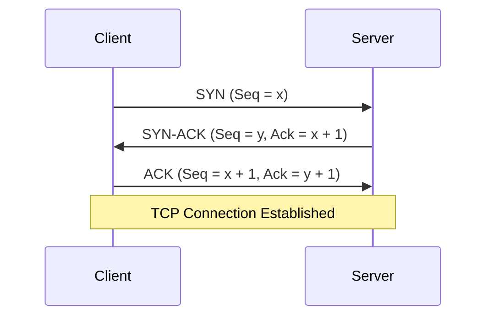
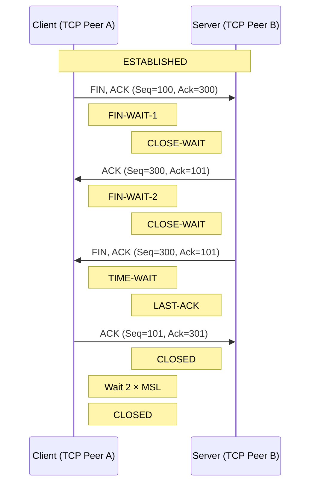

# 1주차 - TCP/IP와 연결

## 학습 목표

- TCP와 UDP의 차이와 사용 사례를 설명할 수 있다.
- TCP 연결 생성과 종료 과정을 설명할 수 있다.
- TIME_WAIT이 필요한 이유를 설명할 수 있다.
- 흐름 제어와 혼잡 제어의 차이를 설명할 수 있다.
- 하나의 TCP 연결이 생성되고 종료되는 전체 흐름을 설명할 수 있다.

## TCP와 UDP

TCP와 UDP는 모두 네트워크 기본 계층 구조(OSI7 or TCP/IP 모델)의 Transport Layer에서 사용되는 통신 프로토콜이며, 프로그램이 다른 호스트의 어플리케이션 및 메시지를 송신/수신할 수 있게 한다. 

### TCP : Transmission Control Protocol

<!-- 연결 지향성, 신뢰성, 순서 보장, 재전송을 설명한다. -->

- **신뢰성**을 가지는 **연결 stream을 기반**으로, **순서를 보장**하는 프로토콜이다. 
  - 재전송 O
- 데이터 Flow가 양방향으로 일어날 수 있다. (방향은 선택사항)
- 기본적으로 신뢰성을 보장하려 하는 특징이 있고, 이를 위해 Congestion Control & Flow Control 이 사용된다. (모두 *Control* 을 위해 사용한다)
- port 번호를 사용해 다중 호스트 간 검증
- 기본적으로는 Unicast만 지원한다.
- Example: FTP(20/21), Telnet(23), rcp(remote copy)...

#### TCP 연결 생성: 3-way Handshake

<!-- SYN, SYN-ACK, ACK의 흐름과 각 단계의 시퀀스 번호 변화를 설명한다. -->

1. 클라이언트(host 1)에서 서버(host 2)로 TCP SYNchronize(SYN) 패킷을 보낸다.
2. 서버가 SYN 패킷을 수신하고 SYNchronize-ACKnowledgement(SYN-ACK) 패킷을 보낸다.
3. 클라이언트에서 SYN-ACK 패킷을 수신한 뒤 서버로 ACK 패킷을 보낸다. 서버가 ACK 패킷을 수신하면 연결이 성립된다.

#### TCP 연결 종료: 4-way Handshake

<!-- FIN과 ACK의 흐름, half-close가 가능한 이유를 설명한다. -->

1. 클라이언트(host 1)가 서버(host 2)로 FIN 패킷을 보내 연결 종료를 요청한다.
   - 클라이언트는 `FIN-WAIT-1` 상태로 진입한다.
2. 서버가 FIN을 수신하고 클라이언트에게 ACK 패킷을 보낸다.
   - 서버는 `CLOSE-WAIT` 상태로 진입한다.
   - ACK를 수신한 클라이언트는 `FIN-WAIT-2` 상태로 진입한다.
   - 이 시점부터 클라이언트로부터 서버 방향의 전송은 종료되지만, 서버로부터 클라이언트 방향의 데이터 전송은 가능하다(half-close).
3. 서버 측 애플리케이션도 연결 종료를 요청하면 서버가 클라이언트에게 FIN 패킷을 보낸다.
   - 서버는 `LAST-ACK` 상태로 진입한다.
4. 클라이언트가 FIN을 수신하고 서버로 ACK 패킷을 보낸다.
   - 서버는 ACK를 수신하면 `CLOSED` 상태가 된다.
   - 클라이언트는 `TIME-WAIT` 상태에서 2 × MSL(Maximum Segment Lifetime) 동안 대기한 뒤 `CLOSED` 상태가 된다.

- TIME-WAIT 하는 이유
  1. 마지막 ACK가 유실됐을 때 재전송
    - A가 B의 FIN을 받고 마지막 ACK를 보냈을 때, ACK가 유실되는 경우 B가 FIN을 재전송한다.
    - A가 바로 CLOSED로 사라지지 않고 TIME-WAIT에 남아 있어야 그 FIN을 받고 ACK를 다시 보낼 수 있음.
  2. 이전 연결에서 늦게 도착한 중복 세그먼트가 새 연결에 섞이는 것을 막기 위해
    - 동일 IP/Port 조합으로 새 TCP 연결을 바로 만드는 경우, 이전 연결의 오래된 세그먼트가 새 연결의 패킷으로 오인될 위험이 있다.
    - 2 × MSL 동안 기다려 이전 연결의 세그먼트가 네트워크에서 사라질 시간을 확보한다.

#### 흐름 제어

<!-- TODO: 수신 측 처리 속도에 맞추는 목적과 receive window를 설명한다. -->

#### 혼잡 제어

<!-- TODO: 네트워크 혼잡을 제어하는 목적과 congestion window의 역할을 설명한다. -->

#### 흐름 제어와 혼잡 제어 비교

| 구분      | 흐름 제어      | 혼잡 제어          |
| --------- | -------------- | ------------------ |
| 보호 대상 | 수신 측        | 네트워크           |
| 주요 기준 | 수신 버퍼 여유 | 네트워크 혼잡 상태 |
| 핵심 값   | rwnd           | cwnd               |

### UDP : User Datagram Protocol

<!-- 비연결성, 낮은 오버헤드, 데이터그램 특성을 설명한다. -->

- 단방향 User Datagram을 기반으로 하는 프로토콜이며, Application 혹은 IP layer에 메시지를 전달하려 할 때 사용한다.
- 비연결성(Connectionless)인 특징이 있다.
- TCP와 다르게 신뢰성을 특징으로 가지지 않는다고 해서 패킷 내 Checksum이 없는것은 아니다.
- 검증 및 재전송(TCP)을 하지 않고, 이에 의한 딜레이 및 오버헤드보다 Real-time이 더 중요한 시스템에서 사용한다.
- Example: 영상 스트리밍, Regular DNS queries & response.
  - DNS 질의시 timezone 변환이 일어나거나 512 byte 이상 전송이 필요한 경우 등에서 Fallback으로 TCP를 사용할 수 있다.

## 8. IP, Port, Socket

### IP

<!-- TODO: IP가 네트워크에서 호스트를 식별하고 패킷을 전달하는 방식을 설명한다. -->

### Port

<!-- TODO: 한 호스트 안에서 프로세스나 서비스를 구분하는 방법을 설명한다. -->

### Socket

<!-- TODO: 소켓과 TCP 연결을 식별하는 요소를 설명한다. -->

## 9. 추가 학습

### Connection Timeout

<!-- TODO: 연결 시간 초과가 발생하는 단계와 대표 원인을 정리한다. -->

### Local Port 고갈

<!-- TODO: 임시 포트의 역할, 연결 식별자, 고갈 조건을 설명한다. -->

### TIME_WAIT 증가

<!-- TODO: 정상적인 증가와 장애 징후를 구분하고 관찰 방법을 정리한다. -->

## 참고 자료

<!-- RFC, 공식 문서, 신뢰할 수 있는 기술 문서를 우선 기록한다. -->
- [IBM AIX - Networking](https://www.ibm.com/docs/en/aix/7.3.0?topic=networking)
- [MDN Web Glossary](https://developer.mozilla.org/en-US/docs/Glossary)
- [RFC 9293: Transmission Control Protocol (TCP)](https://www.rfc-editor.org/info/rfc9293/)
- [RFC 8095: Services Provided by IETF Transport Protocols and Congestion Control Mechanisms](https://www.rfc-editor.org/info/rfc8095)

