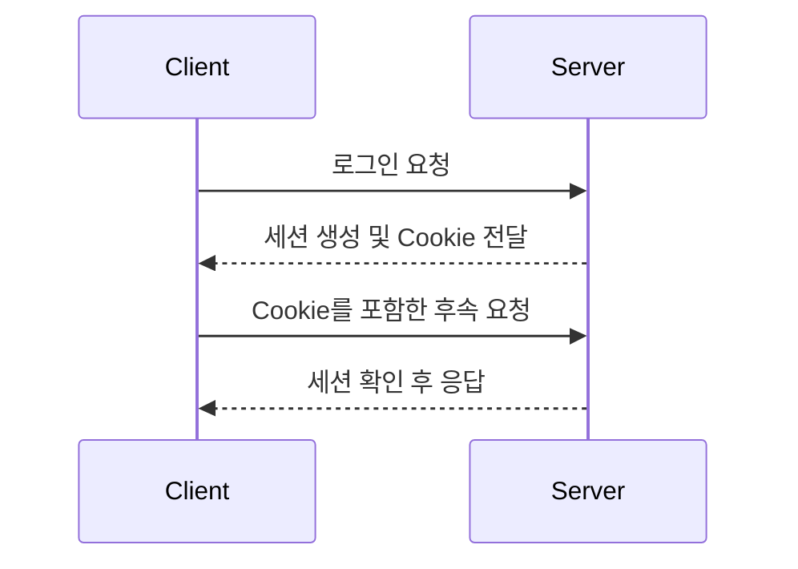

# HTTP와 요청/응답

## 학습 목표

- HTTP 요청과 응답 구조를 설명할 수 있다.
- HTTP Method의 멱등성과 재시도의 관계를 설명할 수 있다.
- HTTP/1.1, HTTP/2, HTTP/3의 주요 차이를 설명할 수 있다.
- Keep-Alive가 연결과 성능에 어떤 영향을 주는지 설명할 수 있다.
- Stateless한 HTTP에서 로그인 상태를 유지할 수 있는 이유를 설명할 수 있다.
- 실패한 HTTP 요청을 재시도할 때 고려해야 할 점을 설명할 수 있다.

## HTTP Request / Response 구조

<!-- HTTP 메시지의 start line, header, 빈 줄, body를 구분하고 각 부분의 역할을 설명한다. -->

### Request

<!-- request line의 method, request target, HTTP version과 주요 request header를 실제 예시로 설명한다. -->

```http
<!-- 학습에 사용할 HTTP 요청 예시를 작성한다. -->
```

### Response

<!-- status line의 HTTP version, status code, reason phrase와 주요 response header를 실제 예시로 설명한다. -->

```http
<!-- 위 요청에 대응하는 HTTP 응답 예시를 작성한다. -->
```

## HTTP Method

<!-- 각 Method의 의미와 안전성(safe), 멱등성(idempotent), 캐시 가능 여부를 비교한다. -->

| Method | 주요 용도 | 안전성 | 멱등성 | 요청 Body | 예시 |
| ------ | --------- | ------ | ------ | --------- | ---- |
| GET    |           |        |        |           |      |
| HEAD   |           |        |        |           |      |
| POST   |           |        |        |           |      |
| PUT    |           |        |        |           |      |
| PATCH  |           |        |        |           |      |
| DELETE |           |        |        |           |      |

## HTTP Status Code

<!-- 상태 코드 클래스별 의미를 설명하고 자주 접하는 상태 코드를 요청 성공, 클라이언트 오류, 서버 오류 관점에서 정리한다. -->

| 범위 | 의미 | 대표 상태 코드 | 처리 시 고려할 점 |
| ---- | ---- | -------------- | ----------------- |
| 1xx  |      |                |                   |
| 2xx  |      |                |                   |
| 3xx  |      |                |                   |
| 4xx  |      |                |                   |
| 5xx  |      |                |                   |

## HTTP 멱등성

<!-- 같은 요청을 여러 번 수행해도 서버의 의도된 상태가 한 번 수행했을 때와 같은 성질을 설명한다. -->

### 멱등성과 재시도

<!-- timeout으로 응답을 받지 못했지만 서버에서는 요청을 처리했을 가능성을 포함하여, Method별 재시도 위험을 설명한다. -->

### Idempotency Key

<!-- 결제나 주문처럼 중복 처리가 위험한 요청에서 idempotency key를 사용하는 목적과 서버의 처리 방식을 설명한다. -->

## HTTP 버전별 특징

### HTTP/1.1

<!-- 지속 연결, 요청 순서, 파이프라이닝과 head-of-line blocking을 설명한다. -->

### HTTP/2

<!-- binary framing, stream multiplexing, header compression과 TCP 수준 head-of-line blocking을 설명한다. -->

### HTTP/3

<!-- QUIC과 UDP의 관계, stream 단위 전송, 연결 수립 지연 관점에서 HTTP/2와 비교한다. -->

| 구분                  | HTTP/1.1 | HTTP/2 | HTTP/3 |
| --------------------- | -------- | ------ | ------ |
| 기반 전송             |          |        |        |
| 메시지 표현           |          |        |        |
| 동시 요청 처리        |          |        |        |
| Head-of-line blocking |          |        |        |
| 연결 수립             |          |        |        |

## Keep-Alive

<!-- 요청마다 새 TCP 연결을 생성하는 방식과 연결을 재사용하는 방식을 비교하고, latency와 서버 자원에 미치는 영향을 설명한다. -->

### Timeout과 연결 관리

<!-- keep-alive timeout이 너무 짧거나 길 때의 장단점과 서버, proxy, client 간 timeout 불일치가 만드는 문제를 정리한다. -->

## Stateless

<!-- HTTP가 stateless하다는 의미와 개별 요청이 독립적으로 처리되는 이유를 설명한다. -->

## Cookie와 Session

<!-- Cookie가 클라이언트에 저장되고 요청에 포함되는 과정과 Session이 서버 측 상태를 유지하는 과정을 설명한다. -->



<!-- 위 흐름에 Cookie의 보안 속성, 세션 만료, 분산 환경에서의 세션 저장 방식을 보충한다. -->

## Timeout

<!-- connection timeout, read timeout 등 timeout의 종류를 나누고 무한 대기를 방지하는 목적을 설명한다. -->

## Retry

<!-- 재시도 가능한 실패와 재시도하면 안 되는 실패를 구분하고 최대 횟수, exponential backoff, jitter를 설명한다. -->

## Rate Limiting

<!-- rate limiting의 목적과 HTTP 429 응답, 응답 Header를 활용한 대기 전략을 설명한다. -->

## 백지 복습

1. HTTP 요청과 응답 메시지를 직접 작성하고 각 구성 요소를 설명한다.
2. POST 요청이 timeout 됐을 때 즉시 재시도하면 위험할 수 있는 이유를 설명한다.
3. HTTP/1.1, HTTP/2, HTTP/3에서 여러 요청을 처리하는 방식의 차이를 설명한다.
4. HTTP가 stateless함에도 로그인 상태를 유지하는 과정을 설명한다.
5. HTTP 429 응답을 받았을 때 클라이언트가 취할 전략을 설명한다.

## 참고 자료

<!-- RFC와 브라우저 또는 서버의 공식 문서를 우선 기록한다. -->

## 함께 읽기

- [[03_Resource/04_network/01_tcp|1주차 - TCP/IP와 연결]]
- [[03_Resource/04_network/04_http_429_ts|HTTP 429 트러블슈팅 사례]]
