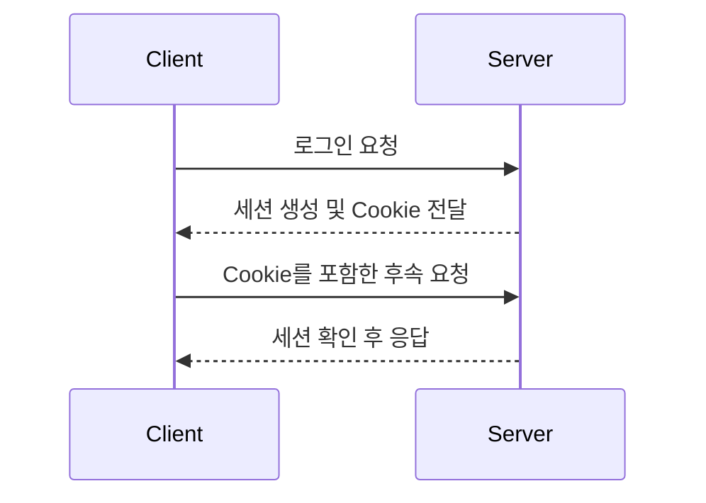

# HTTP와 요청&응답

## 학습 목표

- HTTP 요청과 응답 구조를 설명할 수 있다.
- HTTP Method의 멱등성과 재시도의 관계를 설명할 수 있다.
- HTTP/1.1, HTTP/2, HTTP/3의 주요 차이를 설명할 수 있다.
- Keep-Alive가 연결과 성능에 어떤 영향을 주는지 설명할 수 있다.
- Stateless한 HTTP에서 로그인 상태를 유지할 수 있는 이유를 설명할 수 있다.
- 실패한 HTTP 요청을 재시도할 때 고려해야 할 점을 설명할 수 있다.

## HTTP: Hypertext Transfer Protocol

- HTTP는 네트워크상의 리소스 표현을 요청하고 응답받기 위한 application-level request/response 프로토콜이다.
- stateless
  - 각 요청은 원칙적으로 다른 요청이나 연결의 상태에 의존하지 않고 독립적으로 해석할 수 있으나, 이것이 서버가 애플리케이션 상태를 저장할 수 없다는 의미는 아니다.
  - Cookie, Session, Token 등을 사용해 여러 요청에 걸친 사용자 상태를 유지할 수 있다.

## HTTP Request / Response 구조

<!-- HTTP/1.1 기준 status line의 HTTP version, status code, reason phrase를 설명하고,
HTTP/2 이상에서는 표현 방식이 달라짐을 설명한다. -->


<!-- 1. A start-line is a single line that describes the HTTP version along with the request method or the outcome of the request.
2. An optional set of HTTP headers containing metadata that describes the message. For example, a request for a resource might include the allowed formats of that resource, while the response might include headers to indicate the actual format returned.
3. An empty line indicating the metadata of the message is complete.
4. An optional body containing data associated with the message. This might be POST data to send to the server in a request, or some resource returned to the client in a response. Whether a message contains a body or not is determined by the start-line and HTTP headers. -->

1. start-line은 http 버전과 요청 메서드 혹은 응답 코드를 명시
2. HTTP header field에는 메시지 처리 조건, 대상 리소스, 표현 형식 등의 메타데이터가 포함된다.
   메시지 구조상 header field가 없을 수도 있지만, HTTP 버전과 메시지 종류에 따라
   `Host`처럼 반드시 포함해야 하는 field가 존재한다.
3. 헤더 이후 빈 line은 헤더 종료를 의미
4. message body(필수 X)는 메시지의 데이터를 포함한다. 
    이는 서버에 post하려는 데이터일수도 있고, client에게 전달될 리소스일수도 있다. 
    body를 포함할지 아닌지는 start line과 http header에서 결정된다.

위 구조는 HTTP/1.1 메시지의 textual wire format을 기준으로 한다.
HTTP/2와 HTTP/3는 같은 HTTP semantics를 binary frame과 pseudo-header로 표현한다.

### Request

<!-- request line의 method, request target, HTTP version과 주요 request header를 실제 예시로 설명한다. -->

```http
POST /users HTTP/1.1
Host: example.com
Content-Type: application/x-www-form-urlencoded
Content-Length: 49

name=FirstName+LastName&email=bsmth%40example.com
```

#### start line

- start line은 위와 같이 `<method> <request-target> <HTTP-version>`의 세 파트 형태로 구성된다.
  - `<method>`: request의 의미와 요청으로 원하는 결과를 명시함
  - `request-target`은 상황에 따라 다음 형태를 사용한다.
    - origin-form: `/users/123`
    - absolute-form: `https://example.com/users/123`
    - authority-form: `example.com:443`
      - `CONNECT`에서 사용한다.
    - asterisk-form: `*`
      - `OPTIONS *`처럼 특정 리소스가 아닌 서버 전체의 통신 옵션을 조회할 때 사용한다.
  - `<protocol>`: HTTP 버전을 명시한다. HTTP/2 이상에서는 연결하면서 버전을 알수 있어서 헤더에서 명시하지 않는다.

#### request header


- 요청 헤더는 요청에 필요한 추가 정보 혹은 이 요청이 서버에서 다뤄져야하는 방식을 명시한다.
- Representation headers는 body가 있는 경우 메시지 데이터의 형식과 인코딩을 명시한다.

#### request body

- 서버에 정보를 전달하기 위해 사용한다.
- `PATCH`, `POST`, `PUT`에만 존재

### Response

<!-- status line의 HTTP version, status code, reason phrase와 주요 response header를 실제 예시로 설명한다. -->

서버로부터 응답받은 메시지를 의미한다.

```http
HTTP/1.1 201 Created
Content-Type: application/json
Location: http://example.com/users/123

{
  "message": "New user created",
  "user": {
    "id": 123,
    "firstName": "Example",
    "lastName": "Person",
    "email": "bsmth@example.com"
  }
}
```

#### start line

- start line은 위와 같이 `<protocol> <status-code> <reason-phrase>`의 세 파트 형태로 구성된다.
  - `<protocol>`: HTTP 버전을 명시한다.
  - `<status-code>`: 클라이언트 요청의 성공/실패 여부를 표시한다.
  - `<reason-phrase>`: Optional. 상태 코드가 간단히 상태만을 명시한다면 이 부분은 요청에 의한 결과를 상세히 알려주는 역할이다.

#### response header


- Response header : 클라이언트가 추가 요청을 위해 필요한 정보들을 제공한다.
- Representation header : message부분의 데이터 형태 및 인코딩 형태 등 형태 정보를 제공한다.

#### request body

성공시 클라이언트가 요청한 데이터, 실패 혹은 이상이 있는 경우 요청에 왜 문제가 생겼는지 / 이 현상이 일시적인지 혹은 영구적인지 등을 표시한다. 필수는 아니며 `201 Created`, `204 No Content`인 경우 body가 없을 수 있다.

## HTTP Method

<!-- 각 Method의 의미와 안전성(safe), 멱등성(idempotent), 캐시 가능 여부를 비교한다. -->

| Method  | 주요 의미                                        | 안전성 | 멱등성 | 요청 Content | 응답 캐시 |
| ------- | -------------------------------------------- | --: | --: | ---------: | ----: |
| GET     | target resource의 representation 조회           |   O |   O |          △ |     O |
| HEAD    | GET과 동일한 header 조회, response content 제외      |   O |   O |          △ |     O |
| OPTIONS | resource 또는 server의 통신 옵션 조회                 |   O |   O |          △ |     X |
| TRACE   | request message의 application-level loop-back |   O |   O |          X |     X |
| PUT     | target resource를 request content로 생성 또는 대체   |   X |   O |          O |     X |
| DELETE  | target URI와 현재 기능 간 연결 제거 요청                 |   X |   O |          △ |     X |
| POST    | target resource 고유 semantics에 따라 content 처리  |   X |   X |          O |   조건부 |
| PATCH   | patch document를 적용해 resource 일부 수정           |   X |   X |          O |   조건부 |
| CONNECT | 대상 서버로 tunnel 생성                             |   X |   X |          X |     X |


- POST, PATCH 는 응답에 명시적으로 캐시 갱신 정보랑 `Content-Location` 헤더가 있을때 캐싱가능

## HTTP Status Code

<!-- 상태 코드 클래스별 의미를 설명하고 자주 접하는 상태 코드를 요청 성공, 클라이언트 오류, 서버 오류 관점에서 정리한다. -->

| 범위 | 의미 | 대표 상태 코드 | 처리 시 고려할 점 |
| ---- | ---- | -------------- | ----------------- |
| 1xx  | Informational responses | `100 Continue`, `101 Switching Protocols` |                   |
| 2xx  | Successful responses | `200 OK`, `201 Created` |                   |
| 3xx  | Redirection messages | `301 Moved Permanently` |                   |
| 4xx  | Client error responses | `400 Bad Request`, `401 Unauthorized`, `403 Forbidden` ... |                   |
| 5xx  | Server error responses | `500 Internal Server Error`              |                   |

## HTTP 멱등성

<!-- 같은 요청을 여러 번 수행해도 서버의 의도된 상태가 한 번 수행했을 때와 같은 성질을 설명한다. -->

동일한 요청을 계속 재시도해도 *동일한 행동을 수행*해야 한다. 이것이 동일한 status code를 반환한다는 의미는 아님에 주의하자.


```http
POST /add_row HTTP/1.1
POST /add_row HTTP/1.1   -> Adds a 2nd row
POST /add_row HTTP/1.1   -> Adds a 3rd row

// POST는 멱등하지 않기 때문에 여러번 호출하면 여러개의 row를 추가한다.
```

```http
DELETE /idX/delete HTTP/1.1   -> Returns 200 if idX exists
DELETE /idX/delete HTTP/1.1   -> Returns 404 as it just got deleted
DELETE /idX/delete HTTP/1.1   -> Returns 404

// DELETE 는 멱등하기 때문에 여러번 호출해도 idx값의 리소스를 지우려는 동작을 시도한다.
// 동일한 리소스에 대해 삭제를 시도한다고 해서 상태 코드도 동일하게 호출되지 않음에 유의한다.
```

### 멱등성과 재시도

<!-- TODO: timeout으로 응답을 받지 못했지만 서버에서는 요청을 처리했을 가능성을 포함하여, Method별 재시도 위험을 설명한다. -->

### Idempotency Key

<!-- 결제나 주문처럼 중복 처리가 위험한 요청에서 idempotency key를 사용하는 목적과 서버의 처리 방식을 설명한다. -->

멱등하지 않은 POST, PATCH 요청은 원래 멱등하지 않기 때문에 서버의 상태가 요청할 때마다 바뀔 수 있다. 결제/주문처럼 중복 처리가 위험한 요청인 경우 `Idempotency-Key` 헤더를 사용해서 중복 처리를 방지할 수 있다. 표준은 아니다.

- Client 에서는 요청시 헤더에 이 키값을 붙여서 보낸다. 매 요청마다 키 값이 unique하며, 동일 요청 재전송시에는 키 값이 동일해야 한다.
- Server는 `Idempotency-Key` 를 지원해야 한다. 

## HTTP 버전별 특징

### HTTP/1.1

<!-- 지속 연결, 요청 순서, 파이프라이닝과 head-of-line blocking을 설명한다. -->

- 연결이 재사용 될 수 있다.
- 파이프라이닝이 추가되어, 첫번째 요청이 완료되지 않아도 두번째 요청을 보낼 수 있게 해 레이턴시를 줄였다.
- Chunked response 지원
- 캐시 컨트롤 지원
- client와 server가 어떤 content를 주고받을지 명시해야 한다.
- 동일 IP 주소 내에서 다른 호스트 도메인을 사용할 수 있다. (`Host` 헤더)

### HTTP/2

<!-- binary framing, stream multiplexing, header compression과 TCP 수준 head-of-line blocking을 설명한다. -->

- binary 프로토콜. 임의로 생성 및 읽기 안됨. 향상된 최적화 테크닉 구현을 가능하게 함.
- multiplexed protocol이라 동일 connection 내에서 parallel request 가능
- 헤더 압축. 데이터 전송 중복과 overhead를 줄임.

### HTTP/3

<!-- QUIC과 UDP의 관계, stream 단위 전송, 연결 수립 지연 관점에서 HTTP/2와 비교한다. -->

- Transport 레이어에서 tcp대신 quic 사용.
- http/2가 multiplex 지원하긴하는데 tcp라 스트림 블로킹할수 있어서 QUIC씀
- quic: multiple stream 지원, 패킷 로스 감지, 각 stream단위 재전송. 오류가 있으면 해당 패킷 스트림만 블럭됨

| 구분                  | HTTP/1.1 | HTTP/2 | HTTP/3 |
| --------------------- | -------- | ------ | ------ |
| 기반 전송             | O         | O       | O       |
| 메시지 표현           | O         | O       | O       |
| 동시 요청 처리        | O         | O       | O       |
| Head-of-line blocking | O         | X       | X       |
| 연결 수립             | O         | O       | X       |


## Keep-Alive

<!-- TODO: 요청마다 새 TCP 연결을 생성하는 방식과 연결을 재사용하는 방식을 비교하고, latency와 서버 자원에 미치는 영향을 설명한다. -->

### Timeout과 연결 관리

<!-- TODO: keep-alive timeout이 너무 짧거나 길 때의 장단점과 서버, proxy, client 간 timeout 불일치가 만드는 문제를 정리한다. -->

## Stateless

<!-- TODO: HTTP가 stateless하다는 의미와 개별 요청이 독립적으로 처리되는 이유를 설명한다. -->

## Cookie와 Session

<!-- TODO: Cookie가 클라이언트에 저장되고 요청에 포함되는 과정과 Session이 서버 측 상태를 유지하는 과정을 설명한다. -->



<!-- TODO: 위 흐름에 Cookie의 보안 속성, 세션 만료, 분산 환경에서의 세션 저장 방식을 보충한다. -->

## Timeout

<!-- TODO: connection timeout, read timeout 등 timeout의 종류를 나누고 무한 대기를 방지하는 목적을 설명한다. -->

## Retry

<!-- TODO: 재시도 가능한 실패와 재시도하면 안 되는 실패를 구분하고 최대 횟수, exponential backoff, jitter를 설명한다. -->

## Rate Limiting

<!-- TODO: rate limiting의 목적과 HTTP 429 응답, 응답 Header를 활용한 대기 전략을 설명한다. -->

## 참고 자료

<!-- RFC와 브라우저 또는 서버의 공식 문서를 우선 기록한다. -->

-[MDN HTTP](https://developer.mozilla.org/en-US/docs/Web/HTTP)

## 함께 읽기

- [[03_Resource/04_network/01_tcp|1주차 - TCP IP와 연결]]
- [[03_Resource/04_network/04_http_429_ts|HTTP 429 트러블슈팅 사례]]
