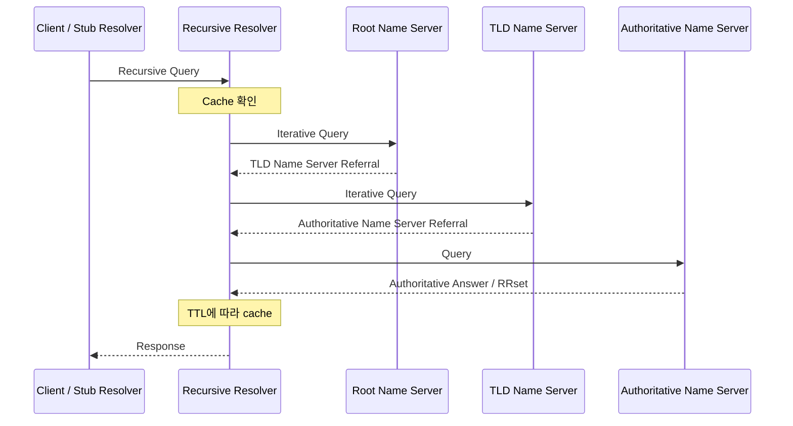
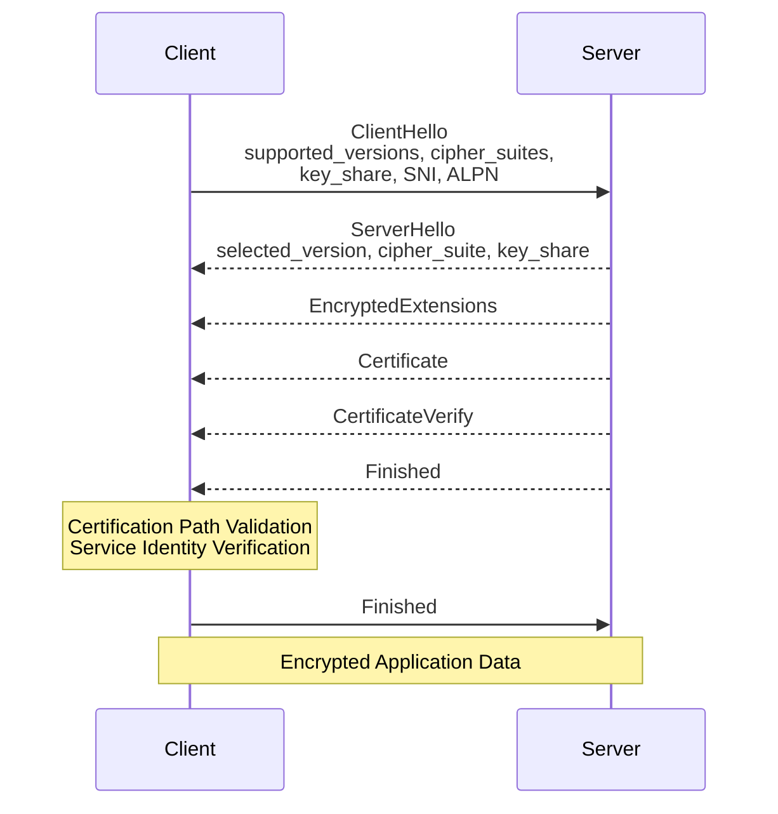

# DNS, HTTPS, Proxy, Load Balancer

## 학습 목표

- DNS의 계층 구조와 recursive resolution 과정을 설명할 수 있다.
- DNS cache와 TTL, negative caching이 성능과 장애 전파에 미치는 영향을 설명할 수 있다.
- HTTPS에서 TLS가 제공하는 보안 속성과 TLS 1.3 Handshake의 역할을 설명할 수 있다.
- 인증 경로 검증과 서비스 identity 검증을 구분할 수 있다.
- Forward Proxy와 Reverse Proxy가 각각 누구를 대신하는지 설명할 수 있다.
- L4와 L7 Load Balancer가 어떤 정보를 기준으로 트래픽을 분산하는지 설명할 수 있다.
- URL 요청이 Backend에 도달하지 못했을 때 DNS부터 Backend까지 계층별로 진단할 수 있다.

## 전체 요청 흐름

<!--
아래 흐름은 대표적인 예시다.

주의:
- hosts file과 브라우저·OS cache는 DNS 서버 계층이 아니라, DNS 질의 전후에 관여하는
  client-side name resolution 과정이다.
- HTTP/1.1과 HTTP/2는 일반적으로 TCP 위에서 TLS를 사용한다.
- HTTP/3는 QUIC 위에서 동작하며, TLS 1.3 Handshake가 QUIC 연결 과정에 통합된다.
- CDN, WAF, Load Balancer, Reverse Proxy는 없을 수도 있고 여러 개일 수도 있다.
- 하나의 제품이나 프로세스가 Load Balancer와 Reverse Proxy 역할을 함께 수행할 수도 있다.

작성할 내용:
1. URL을 scheme, authority, path, query 등으로 해석하는 단계
2. local name resolution과 recursive DNS resolution의 구분
3. HTTP version에 따른 transport 및 TLS 연결 차이
4. intermediary가 0개 이상 존재할 수 있다는 점
5. Backend 이후 application, cache, DB 호출은 이번 범위에서 어디까지 다룰지
-->

```text
URL 해석
→ Local Name Resolution
  ├─ Browser/Application Cache
  ├─ OS Cache
  └─ hosts file
→ Recursive DNS Resolution
→ 대상 IP 선택
→ 연결 수립
  ├─ HTTP/1.1·HTTP/2: TCP → TLS
  └─ HTTP/3: QUIC + TLS 1.3
→ HTTP 요청
→ CDN / WAF / Load Balancer / Reverse Proxy (0개 이상)
→ Backend
```

## DNS

- DNS(Domain Name System)는 Domain Name과 Resource Record를 관리하고 조회하기 위한 계층적·분산형 naming system이자 query-response protocol이다.
- DNS에 저장된 정보는 여러 authoritative server에 분산되어 있으며, domain namespace의 관리 권한은 zone 단위로 위임된다.

### DNS의 역할

<!--
DNS를 단순히 "Domain Name을 IP 주소로 변환하는 시스템"이라고만 정의하지 않는다.

작성할 내용:
- 계층적으로 관리되는 distributed database이자 query-response protocol이라는 점
- Domain Name에 연결된 Resource Record를 조회한다는 점
- A/AAAA는 가능한 결과 중 일부이며, MX·NS·TXT 등 IP가 아닌 정보도 반환한다는 점
- namespace, zone, delegation의 관계
- authoritative data와 cached data의 차이
-->

DNS는 인간에게 친숙하게 작성된 domain name(`example.com`)을 연결된 Resource Record를 조회한다.

A·AAAA Record를 이용해 Domain Name에 대응하는 IPv4·IPv6 주소를 조회할 수 있으며, 그 밖에도 mail server를 나타내는 MX, authoritative name server를 나타내는 NS, 문자열 정보를 저장하는 TXT 등 다양한 정보를 조회할 수 있다.

Domain Name에 연결된 정보를 찾는 전체 과정을 DNS resolution이라고 한다. DNS resolution 과정에서 resolver는 질의한 Domain Name과 Record Type에 해당하는 RRset을 찾는다.


### DNS 구성 요소

<!--
각 구성 요소가 "누구에게 질의하고 어떤 형태로 응답하는지"를 중심으로 작성한다.

- Stub Resolver
- Recursive Resolver
- Root Name Server
- TLD Name Server
- Authoritative Name Server
- Zone
- Delegation
- Referral
-->


top level domain server(=TLD, 제일 뒤, .com, .org, .net )부터 우측에서부터 해석

유저가 브라우저에 주소를 입력하면, 브라우저 캐시에 없는 경우 recursive server로 질의를 시도한다.
recursive server에 캐시가 없는 경우 DNS 계층에 따라 하위 dns 계층으로 쿼리해 A/AAAA 레코드에서 IP 주소 등 리소스를 찾는다.

- Stub Resolver 

- Recursive Resolver : 질의용 서버. (= DNS resolvers)
   - 보통 ISP사, 서드파티 DNS 프로바이더에 의해 관리됨.
   - 질의 결과를 캐시하고 이를 위한 time-to-live 설정 가능
- Authoritative Name Server : 요청 레코드에 권한이 있는경우 질의해 응답받음
   - Root Name Server : 최상위에 위치, 루트 존 제공. 적절한 TLD 서버로 요청 전달
   - TLD Name Server : 해당 TLD 내 다음 계층 서버에 질의할거 찾음 

> 읽기 자료
>
> - [DNS-TERM] RFC 9499: stub resolver, recursive resolver, authoritative server, referral
> - [DNS-CONCEPT] RFC 1034 Section 4.3, Section 5.3

### DNS 조회 과정

<!--
아래 다이어그램은 recursive resolver가 cache miss인 경우 iterative query를 수행하는
대표적인 흐름이다.

작성할 내용:
1. Client의 stub resolver가 recursive resolver에 recursive query를 전달
2. Recursive resolver가 cache를 먼저 확인
3. Cache miss이면 root → TLD → authoritative server 순으로 iterative query 수행
4. Referral에는 다음으로 질의할 name server 정보가 포함될 수 있음
5. 최종 RRset을 TTL과 함께 cache한 뒤 client에 반환
6. CNAME이 있으면 추가 조회가 발생할 수 있음
7. 실제 구현에서는 QNAME minimization, DNSSEC, forwarding 등으로 흐름이 달라질 수 있음
-->



> 읽기 자료
>
> - [DNS-CONCEPT] RFC 1034 Section 5.3: resolver algorithm
> - [DNS-TERM] RFC 9499: recursive mode, iterative mode, referral
> - [DNS-IMPL] RFC 1035 Section 4: DNS message format

### 주요 DNS Record

<!--
Record의 "owner name, TTL, class, type, RDATA" 구조를 먼저 설명한 뒤 표를 작성한다.

주의:
- CNAME은 "다른 domain의 IP를 복사하는 record"가 아니라 owner name을 canonical name의
  alias로 만드는 record다.
- NS는 zone의 authoritative name server를 지정한다.
- MX의 preference 값은 숫자가 작을수록 우선순위가 높다.
- TXT는 임의의 문자열을 저장하지만, 실제 사용 방식은 상위 protocol별 규칙에 따른다.
- AAAA 정의는 RFC 3596을 참고한다.
-->

| Record | 역할 | RDATA 예시 | 주의할 점 |
| ------ | ---- | ---------- | --------- |
| A      |      |            |           |
| AAAA   |      |            |           |
| CNAME  |      |            |           |
| NS     |      |            |           |
| MX     |      |            |           |
| TXT    |      |            |           |

> 읽기 자료
>
> - [DNS-IMPL] RFC 1035 Section 3.3: A, CNAME, NS, MX, TXT
> - [DNS-IPV6] RFC 3596 Section 2: AAAA
> - [DNS-IANA] IANA DNS Parameters: 현재 등록된 RR TYPE 확인

### DNS Cache와 TTL

<!--
작성할 내용:
- TTL은 RR을 cache에서 재사용할 수 있는 시간
- TTL이 길 때: cache hit 증가, authoritative query 감소, 변경 반영 지연
- TTL이 짧을 때: 변경 반영 속도 증가, resolver와 authoritative server 부하 증가
- authoritative server에서 TTL을 바꿔도 이미 cache된 응답의 남은 TTL은 즉시 사라지지 않음
- 장애 전환 전에 TTL을 미리 낮추는 이유
- browser, OS, recursive resolver 등이 각각 cache할 수 있다는 점
- 실제 cache 정책이 RFC TTL과 완전히 동일하지 않을 수 있는 구현 차이
-->

> 읽기 자료
>
> - [DNS-IMPL] RFC 1035 Section 4.1.3: TTL field
> - [DNS-CONCEPT] RFC 1034 Section 4.2.1: cache와 TTL

### Negative Caching

<!--
다음 세 종류를 구분한다.

1. NXDOMAIN
   - 질의한 domain name 자체가 존재하지 않음
2. NODATA
   - domain name은 존재하지만 요청한 RR type의 data가 없음
3. Resolution Failure
   - SERVFAIL, timeout, unreachable server 등으로 유용한 응답을 얻지 못함

작성할 내용:
- NXDOMAIN/NODATA negative response의 TTL이 SOA와 어떤 관계가 있는지
- 실패 결과를 cache하지 않으면 반복 질의가 장애를 증폭할 수 있는 이유
- RFC 9520에서 resolution failure caching을 요구하는 이유
-->

> 읽기 자료
>
> - [DNS-NCACHE] RFC 2308: NXDOMAIN, NODATA negative caching
> - [DNS-FAILCACHE] RFC 9520: SERVFAIL·timeout 등 resolution failure caching
> - [DNS-TERM] RFC 9499: negative response 관련 용어

### DNS 진단

```bash
# 기본 조회: status, flags, answer, authority, 응답 resolver 확인
dig example.com A

# 특정 recursive resolver와 결과 비교
dig @1.1.1.1 example.com A
dig @8.8.8.8 example.com A

# local dig가 root부터 delegation을 따라가며 iterative resolution 수행
dig +trace example.com

# 필요한 section만 출력
dig example.com A +noall +answer +authority +additional

# authoritative name server에 직접 질의
dig @<authoritative-name-server> example.com A

# 존재하지 않는 이름으로 NXDOMAIN과 SOA 확인
dig does-not-exist.example.com A

# 간단한 이름 조회
nslookup example.com
```

<!--
`dig +trace` 주의:
- 현재 사용 중인 recursive resolver가 내부적으로 수행한 과정을 보여주는 명령이 아니다.
- dig 자체가 root부터 iterative query를 수행하여 delegation path를 확인한다.

출력에서 확인할 항목:
- status: NOERROR, NXDOMAIN, SERVFAIL, REFUSED
- flags: aa, rd, ra, ad 등
- QUESTION / ANSWER / AUTHORITY / ADDITIONAL
- SERVER
- Query time
- 각 RR의 TTL
- CNAME chain
- authoritative answer 여부
-->

| 항목 | 의미 | 장애 시 확인할 내용 |
| ---- | ---- | ------------------- |
| `status` |  |  |
| `aa` |  |  |
| `rd` / `ra` |  |  |
| `ANSWER` |  |  |
| `AUTHORITY` |  |  |
| `ADDITIONAL` |  |  |
| `SERVER` |  |  |
| `Query time` |  |  |

> 읽기 자료
>
> - [BIND-DIG] BIND 9 Manual: `dig`, `nslookup`
> - [DNS-IMPL] RFC 1035 Section 4.1: DNS message sections and flags

## HTTP와 HTTPS

<!--
HTTP와 HTTPS를 완전히 다른 application protocol로 설명하지 않는다.

작성할 내용:
- HTTP는 application-level semantics를 정의
- `https` URI는 HTTP 통신을 TLS로 보호하고 서버 identity를 검증할 것을 요구
- TLS가 HTTP method, status code, header 의미를 정의하는 것은 아님
- HTTPS가 application 자체의 취약점이나 endpoint 침해까지 해결하지는 않음
-->

| 구분 | HTTP | HTTPS |
| ---- | ---- | ----- |
| 전송 구간 보호 |  |  |
| 서버 identity 검증 |  |  |
| URL Scheme |  |  |
| 기본 Port |  |  |
| HTTP semantics |  |  |

> 읽기 자료
>
> - [HTTP-SEMANTICS] RFC 9110: HTTP와 `http`·`https` URI
> - [TLS13] RFC 9846 Section 1: TLS가 제공하는 보호

## 암호화 기초

### 대칭키 암호화

<!--
작성할 내용:
- 같은 secret key를 기반으로 암호화와 복호화 수행
- 대용량 Application Data 보호에 효율적
- 통신 전 key를 안전하게 공유해야 하는 문제
- TLS 1.3에서는 AEAD algorithm으로 confidentiality와 integrity를 함께 제공
-->

### 비대칭키 암호화

<!--
작성할 내용:
- public key와 private key의 역할
- digital signature와 encryption을 구분
- 인증서의 public key로 Application Data 전체를 직접 암호화한다고 설명하지 않기
- TLS 1.3의 일반적인 ECDHE key agreement와 certificate signature의 역할을 구분
-->

### Hash, MAC, Digital Signature

<!--
선택적으로 작성하되 다음을 혼동하지 않는다.

- Hash: 입력으로부터 고정 길이 digest 계산
- MAC: shared secret을 가진 상대끼리 integrity와 authenticity 확인
- Digital Signature: private key로 서명하고 public key로 검증
- TLS 1.3 Finished는 handshake secret 기반 검증 값
- CertificateVerify는 인증서 private key possession을 증명하는 signature
-->

### TLS에서의 조합

<!--
"비대칭키로 대칭키 자체를 암호화해 전달한다"는 오래된 RSA key transport 중심 설명으로
TLS 1.3을 정리하지 않는다.

TLS 1.3 기준 작성할 내용:
1. (EC)DHE key share로 shared secret 합의
2. 인증서와 CertificateVerify로 server authentication
3. HKDF 기반 key schedule로 traffic key 파생
4. Application Data는 파생된 symmetric AEAD key로 보호
5. 비대칭 연산과 대칭 연산을 조합하는 이유
-->

> 읽기 자료
>
> - [TLS13] RFC 9846 Sections 2, 4, 7
> - [TLS13-TRACE] RFC 8448: TLS 1.3 example handshake traces

## TLS Handshake

### TLS 1.3 Full Handshake

<!--
2026-08-04 기준 TLS 1.3의 현재 명세는 RFC 9846이며 RFC 8446을 obsoletes한다.

아래는 server certificate authentication을 사용하는 대표적인 full handshake다.
CertificateRequest와 client certificate 관련 message는 생략했다.

주의:
- TLS 1.3에서는 ServerHello 이후 handshake message가 handshake key로 보호된다.
- 일반적인 full handshake에서 server Finished가 client Finished보다 먼저 전송된다.
- 실제 packet 수와 TCP segment 수가 handshake message 수와 일치하는 것은 아니다.
-->



<!--
각 message의 역할:
- ClientHello:
- ServerHello:
- EncryptedExtensions:
- Certificate:
- CertificateVerify:
- Finished:
-->

> 읽기 자료
>
> - [TLS13] RFC 9846 Section 2, Section 4
> - [TLS13-TRACE] RFC 8448 Section 3: example full handshake
> - [PKIX] RFC 5280: certificate path validation
> - [TLS-ID] RFC 9525: hostname 등 service identity 검증

### TLS 1.2와 TLS 1.3 비교

<!--
전체 message를 외우기보다 아래 차이를 중심으로 작성한다.

- TLS 1.3은 legacy algorithm과 RSA key transport를 제거
- full handshake의 round trip 감소
- cipher suite가 나타내는 범위 변화
- ServerHello 이후 handshake message encryption
- forward secrecy를 제공하는 (EC)DHE 중심 key agreement
- session resumption과 0-RTT의 존재 및 replay 위험
-->

| 항목 | TLS 1.2 | TLS 1.3 |
| ---- | ------- | ------- |
| Full Handshake RTT |  |  |
| Key Exchange |  |  |
| Cipher Suite가 포함하는 범위 |  |  |
| Handshake message 보호 시점 |  |  |
| 0-RTT |  |  |

> 읽기 자료
>
> - [TLS13] RFC 9846 Appendix E 및 protocol overview
> - [TLS-DEPLOY] RFC 9325: TLS deployment recommendations

### HTTP/3와 TLS

<!--
HTTP/3에서는 "TCP 연결 → 별도 TLS record layer" 흐름으로 설명하지 않는다.

작성할 내용:
- HTTP/3는 QUIC transport 위에서 동작
- QUIC은 TLS 1.3 Handshake를 사용해 key를 얻음
- TLS record를 QUIC 위에 싣는 것이 아니라 QUIC이 packet protection과 신뢰성 제공
- ALPN `h3`를 이용해 HTTP/3를 협상
-->

```text
HTTP/1.1 or HTTP/2
HTTP → TLS Records → TCP → IP

HTTP/3
HTTP/3 → QUIC Streams / Frames → QUIC Packet Protection → UDP → IP
                         ↑
                  TLS 1.3 Handshake
```

> 읽기 자료
>
> - [QUIC-TLS] RFC 9001 Sections 2~4
> - [HTTP3] RFC 9114 Sections 1~3

## TLS 협상 항목

<!--
TLS 1.3 기준으로 cipher suite와 key exchange를 분리해서 작성한다.
-->

| 항목 | 역할 | ClientHello/ServerHello에서 확인할 내용 |
| ---- | ---- | --------------------------------------- |
| TLS Version | 사용할 TLS protocol version 협상 |  |
| Cipher Suite | AEAD algorithm과 HKDF hash 선택 |  |
| Supported Groups | key agreement에 사용할 group 제안 |  |
| Key Share | (EC)DHE public key share 전달 |  |
| Signature Algorithms | CertificateVerify 등에 사용할 signature algorithm 제안 |  |
| SNI | 접속하려는 server name 전달 |  |
| ALPN | TLS 위에서 사용할 application protocol 협상 |  |

<!--
주의:
- TLS 1.3 cipher suite는 key exchange algorithm과 certificate signature algorithm을
  포함하지 않는다.
- SNI는 server가 virtual host와 certificate를 선택하는 데 사용할 수 있다.
- ALPN 예: `h2`, `http/1.1`, `h3`
-->

> 읽기 자료
>
> - [TLS13] RFC 9846 Sections 4.1~4.2
> - [TLS-SNI] RFC 6066 Section 3
> - [TLS-ALPN] RFC 7301 Section 3

## TLS 진단

```bash
# SNI, hostname 검증, certificate chain, ALPN 확인
openssl s_client \
  -connect example.com:443 \
  -servername example.com \
  -showcerts \
  -verify_hostname example.com \
  -alpn h2,http/1.1 \
  </dev/null

# DNS, connection, TLS, ALPN, HTTP request/response 흐름 확인
curl -v https://example.com

# DNS만 우회하여 특정 IP의 TLS/HTTP 동작 확인
# URL hostname은 유지되므로 Host와 SNI도 example.com으로 사용된다.
curl -v \
  --resolve example.com:443:203.0.113.10 \
  https://example.com/
```

<!--
OpenSSL에서 확인할 항목:
- Protocol
- Cipher
- Server Temp Key
- Certificate chain
- subject / issuer
- Not Before / Not After
- Verify return code
- ALPN protocol

curl -v에서 확인할 항목:
- resolved IP
- connection 대상
- TLS version과 cipher
- certificate subject, issuer, validity, hostname match
- ALPN 결과
- request line / response status
- redirect
-->

| 증상 | 가능한 원인 | 확인 명령 |
| ---- | ----------- | --------- |
| `connection refused` |  |  |
| timeout |  |  |
| certificate expired |  |  |
| hostname mismatch |  |  |
| unknown CA / chain error |  |  |
| ALPN mismatch |  |  |

> 읽기 자료
>
> - [OPENSSL-SCLIENT] OpenSSL `s_client` manual
> - [CURL] curl command-line manual

## 인증서

### 인증서의 역할

<!--
작성할 내용:
- X.509 certificate가 subject identity와 public key 등 정보를 CA signature로 묶는 방식
- certificate가 secret key를 전달하는 문서가 아니라는 점
- server가 CertificateVerify를 통해 대응하는 private key possession을 증명한다는 점
- "CA가 domain 소유권을 영구 보증한다"가 아니라 검증 시점의 trust model과 validity 범위
-->

> 읽기 자료
>
> - [PKIX] RFC 5280 Section 4: certificate fields
> - [TLS13] RFC 9846 Sections 4.4.2~4.4.3

### 인증서 체인

```text
Trust Anchor (Root CA)
└── Intermediate CA
    └── End-Entity / Server Certificate
```

<!--
작성할 내용:
- Server가 보통 leaf와 필요한 intermediate certificate를 전달
- Root CA는 client trust store의 trust anchor로 사용
- Server가 root certificate를 전송하더라도 그것만으로 신뢰되는 것은 아님
- issuer/subject 연결만 보는 것이 아니라 signature와 constraints를 검증
- cross-signing이나 alternate chain이 존재할 수 있음
-->

> 읽기 자료
>
> - [PKIX] RFC 5280 Sections 4, 6

### 인증 경로 검증

<!--
Certification Path Validation에 포함할 내용:
- trust anchor까지 path 구성
- 각 certificate signature 검증
- validity period
- Basic Constraints
- Key Usage / Extended Key Usage
- Name Constraints
- policy와 path length 등

이번 학습 수준에서 모든 RFC 5280 algorithm state를 외울 필요는 없다.
"신뢰 가능한 CA chain인가"를 판단하는 과정으로 정리한다.
-->

### 서비스 Identity 검증

<!--
Certification Path Validation과 별도 절로 작성한다.

작성할 내용:
- client가 접속하려는 reference identifier
- certificate SAN에 제시된 DNS-ID 또는 IP-ID
- hostname과 SAN 비교
- wildcard matching 제한
- chain이 신뢰 가능해도 hostname mismatch이면 실패한다는 점
- CN fallback을 현재 규칙처럼 설명하지 않기
-->

> 읽기 자료
>
> - [TLS-ID] RFC 9525 Sections 4~6
> - [PKIX] RFC 5280 Section 4.2.1.6: Subject Alternative Name

### 인증서 폐기 상태

<!--
깊게 다루지 않아도 된다.

작성할 내용:
- certificate expiry와 revocation은 다른 개념
- CRL
- OCSP
- OCSP Stapling
- 실제 client의 revocation checking과 failure policy는 구현 및 platform에 따라 다를 수 있음
-->

> 읽기 자료
>
> - [PKIX] RFC 5280: CRL
> - [OCSP] RFC 6960: OCSP

## Proxy와 Reverse Proxy

### HTTP Intermediary

<!--
RFC 9110의 용어를 먼저 정리한다.

- Proxy: client가 선택한 message-forwarding agent
- Gateway: inbound connection에서는 origin server처럼 보이고 요청을 다른 server로 전달
- Tunnel: HTTP message를 해석·변경하지 않고 connection 사이를 blind relay
- "Reverse Proxy"는 일반적으로 gateway 역할을 하는 구현을 가리키는 용어로 사용
-->

> 읽기 자료
>
> - [HTTP-SEMANTICS] RFC 9110 Section 3.7

### Forward Proxy

<!--
작성할 내용:
- client 또는 client network를 대신해 외부 server에 요청
- origin server는 직접 client 대신 proxy를 peer로 볼 수 있음
- access control, filtering, egress control, caching, privacy 등 사용 사례
- HTTPS의 CONNECT tunnel과 TLS interception을 구분
-->

```text
Client → Forward Proxy → Origin Server
```

### Reverse Proxy

<!--
작성할 내용:
- client에게 origin server처럼 보이면서 내부 upstream으로 요청 전달
- routing, TLS termination, caching, compression, authentication, WAF 연계
- load balancing과 reverse proxy 기능이 겹칠 수 있음
- reverse proxy가 존재한다고 항상 별도 load balancer가 존재하는 것은 아님
-->

```text
Client → Reverse Proxy / Gateway → Backend
```

| 구분 | Forward Proxy | Reverse Proxy |
| ---- | ------------- | ------------- |
| 대리하는 측 |  |  |
| 누가 설정·선택하는가 |  |  |
| 외부에서 숨겨지는 측 |  |  |
| 주요 목적 |  |  |
| 대표 사례 |  |  |

> 읽기 자료
>
> - [HTTP-SEMANTICS] RFC 9110 Section 3.7
> - [NGINX-PROXY] NGINX `ngx_http_proxy_module`

### Proxy 사용 시 전달 정보

<!--
작성할 header:
- Host
- Forwarded: for, by, host, proto
- X-Forwarded-For
- X-Forwarded-Host
- X-Forwarded-Proto
- X-Real-IP

반드시 신뢰 경계를 함께 작성한다.

핵심:
- Client는 임의의 Forwarded 또는 X-Forwarded-* 값을 직접 보낼 수 있다.
- Application은 외부에서 들어온 값을 무조건 신뢰하면 안 된다.
- 신뢰하는 proxy가 기존 값을 제거·정규화하거나 append한 결과만 신뢰하도록 설정해야 한다.
- 여러 proxy를 거치면 address list의 어느 범위까지 신뢰할지 정의해야 한다.
-->

```http
Forwarded: for=192.0.2.60;proto=https;host=example.com
X-Forwarded-For: 192.0.2.60, 198.51.100.10
X-Forwarded-Proto: https
X-Forwarded-Host: example.com
```

| Header | 전달하려는 원본 정보 | 보안상 주의점 |
| ------ | --------------------- | ------------- |
| `Host` |  |  |
| `Forwarded` |  |  |
| `X-Forwarded-For` |  |  |
| `X-Forwarded-Proto` |  |  |
| `X-Forwarded-Host` |  |  |

> 읽기 자료
>
> - [FORWARDED] RFC 7239
> - [NGINX-PROXY] NGINX `proxy_set_header`, `$proxy_add_x_forwarded_for`

## Load Balancer

### Load Balancer의 역할

<!--
작성할 내용:
- 하나의 service endpoint 뒤에 여러 target을 두고 traffic 분산
- availability, scale-out, maintenance를 지원
- listener, routing rule, target group 개념
- health check 결과에 따라 unhealthy target 제외
- connection draining / deregistration delay
- Load Balancer 자체의 다중 AZ·HA는 제품별 구조가 다름

주의:
- "L4 Load Balancer", "L7 Load Balancer"는 유용한 운영상 분류지만
  모든 제품 기능이 계층 하나에 엄격히 고정되는 것은 아니다.
-->

> 읽기 자료
>
> - [AWS-NLB] AWS Network Load Balancer introduction
> - [AWS-ALB] AWS Application Load Balancer introduction

### L4 Load Balancer

<!--
작성할 내용:
- transport protocol과 flow/connection metadata를 기준으로 target 선택
- source/destination IP, port, protocol 등
- TCP connection 또는 UDP flow 단위로 target affinity가 유지될 수 있음
- payload의 HTTP path, method, header를 기준으로 routing하지 않음
- 높은 처리량, protocol 투명성, client IP preservation 등 제품별 특성
- TCP, UDP, TLS, QUIC 지원 여부는 제품별로 다름

TLS 주의:
- L4 제품이라고 TLS를 절대 처리하지 않는 것은 아니다.
- TCP passthrough를 할 수도 있고, 제품에 따라 TLS listener로 termination할 수도 있다.
-->

### L7 Load Balancer

<!--
작성할 내용:
- HTTP semantics를 해석하여 request 단위 routing 가능
- host, path, method, header, query, cookie 등
- HTTP redirect, authentication, WAF, response modification 등 확장 기능
- HTTP 내용을 확인하려면 일반적으로 해당 지점에서 TLS를 종료하거나 복호화해야 함
- client-side connection과 backend-side connection이 분리될 수 있음
-->

| 구분 | L4 Load Balancer | L7 Load Balancer |
| ---- | ---------------- | ---------------- |
| 주요 판단 기준 |  |  |
| 이해하는 Protocol |  |  |
| Routing 단위 |  |  |
| HTTP Host/Path Routing |  |  |
| TLS 처리 | 제품별로 passthrough 또는 termination |  |
| 장점 |  |  |
| 고려 사항 |  |  |

> 읽기 자료
>
> - [AWS-NLB] AWS NLB: Layer 4, flow hash, connection lifetime
> - [AWS-ALB] AWS ALB: Layer 7, listener rules, target groups

### 부하 분산 방식

<!--
Generic algorithm과 특정 제품 용어를 구분한다.

- Round Robin
- Least Connections
- Least Outstanding Requests
- Weighted Round Robin / Weighted Random
- Source IP Hash
- Consistent Hash

작성할 내용:
- 어떤 상태를 측정해 target을 고르는가
- long-lived connection에서 Round Robin이 불균형할 수 있는 이유
- request 처리 시간이 다양한 경우 least 계열이 유리할 수 있는 이유
- hash 기반 방식이 affinity를 제공하지만 target 변경 시 재배치가 발생하는 이유
- AWS ALB의 `least_outstanding_requests`를 generic `least_connections`와 동일시하지 않기
-->

| 방식 | 선택 기준 | 적합한 상황 | 단점 |
| ---- | --------- | ----------- | ---- |
| Round Robin |  |  |  |
| Least Connections |  |  |  |
| Least Outstanding Requests |  |  |  |
| Hash 기반 |  |  |  |
| Weighted 방식 |  |  |  |

> 읽기 자료
>
> - [NGINX-UPSTREAM] NGINX upstream: round robin, least_conn, ip_hash, hash
> - [AWS-ALB-TG] AWS ALB target group: round robin, least outstanding requests, weighted random

### Health Check

<!--
Load Balancer health check와 Kubernetes probe를 같은 개념으로 정의하지 않는다.

Load Balancer:
- Active health check: 별도 probe를 주기적으로 전송
- Passive health check: 실제 traffic 결과에서 failure 관찰
- protocol, port, path
- interval, timeout
- healthy threshold, unhealthy threshold
- success code
- fail-open/fail-close 등 제품별 동작
- false positive/false negative와 detection time trade-off

Kubernetes 비교:
- readinessProbe: Pod가 Service traffic을 받을 준비가 되었는지 판단
- livenessProbe: container restart가 필요한지 판단
- startupProbe: 느린 startup 동안 liveness/readiness 시작을 지연
- readiness는 LB target eligibility와 목적이 유사하지만 동일한 protocol 개념은 아님
-->

| 설정 | 의미 | 너무 작을 때 | 너무 클 때 |
| ---- | ---- | ------------ | ---------- |
| Interval |  |  |  |
| Timeout |  |  |  |
| Healthy Threshold |  |  |  |
| Unhealthy Threshold |  |  |  |
| Success Code |  |  |  |

> 읽기 자료
>
> - [AWS-ALB-HC] AWS ALB target health checks
> - [AWS-NLB-HC] AWS NLB active/passive health checks
> - [K8S-PROBES] Kubernetes liveness, readiness, startup probes

### Session Persistence

<!--
작성할 내용:
- 동일 client의 후속 request를 같은 target으로 보내는 방식
- cookie-based stickiness
- source IP affinity
- initial target selection 이후 persistence가 algorithm을 우회할 수 있음
- target failure·deregistration 시 다른 target으로 이동할 수 있음

단점:
- target별 부하 불균형
- autoscaling과 rolling deployment 제약
- target 장애 시 in-memory session 손실
- proxy/LB 구성에 대한 application 의존성

대안:
- Backend를 stateless하게 유지
- session state를 Redis, DB 등 shared store에 저장
- 단, 모든 application에서 sticky session이 무조건 잘못된 것은 아님
-->

> 읽기 자료
>
> - [AWS-ALB-TG] AWS ALB Sticky sessions

## TLS Termination 위치

<!--
두 가지가 아니라 아래 세 가지 구조로 비교한다.

1. Edge Termination
   Client와 edge 사이만 TLS, edge→backend는 HTTP
2. TLS Re-encryption / Bridging
   Edge에서 client TLS 종료 후 backend와 별도의 TLS 연결
3. TLS Passthrough
   Edge가 TLS payload를 복호화하지 않고 backend로 전달

주의:
- "Backend까지 TLS 유지"는 re-encryption과 passthrough를 구분해야 한다.
- re-encryption은 end-to-end 단일 TLS session이 아니다.
- passthrough에서는 L7 HTTP routing과 WAF inspection이 제한될 수 있다.
-->

```text
1. Edge Termination
Client ── HTTPS ──> Edge ── HTTP ──> Backend

2. TLS Re-encryption
Client ── HTTPS ──> Edge ── HTTPS ──> Backend
       TLS Session A       TLS Session B

3. TLS Passthrough
Client ── TLS/HTTPS ─────────────────> Backend
               Edge는 암호문 전달
```

| 방식 | Edge의 HTTP 가시성 | Backend 구간 보호 | 장점 | 고려 사항 |
| ---- | ------------------ | ----------------- | ---- | --------- |
| Edge Termination |  |  |  |  |
| TLS Re-encryption |  |  |  |  |
| TLS Passthrough |  |  |  |  |

<!--
추가로 생각할 내용:
- certificate를 어디에 배포하는가
- SNI 기반 routing 가능 여부
- client certificate / mTLS를 어느 지점에서 검증하는가
- original scheme을 Backend에 어떻게 전달하는가
- 내부 CA와 certificate rotation 운영 비용
-->

> 읽기 자료
>
> - [AWS-NLB] AWS NLB protocol 및 TLS listener 개요
> - [AWS-ALB] AWS ALB HTTPS listener와 Layer 7 processing
> - [HTTP-SEMANTICS] RFC 9110 intermediary와 connection 분리

## 요청 흐름 종합

<!--
하나의 URL 예시를 정한 뒤 각 단계에서 "관측 가능한 사실"을 기록한다.

예시:
https://api.example.com/users?id=1

확인할 내용:
1. URL
   - scheme, host, port, path, query
2. DNS
   - A/AAAA/CNAME, TTL, authoritative server
3. Network
   - 선택된 IP, route, firewall/security group, TCP 또는 QUIC
4. TLS
   - SNI, certificate SAN, chain, validity, protocol, cipher, ALPN
5. Load Balancer
   - listener, rule, target group, health state
6. Reverse Proxy
   - Host/path rewrite, forwarded header, upstream timeout
7. Backend
   - application listen port, route mapping, log, dependency 상태
-->

| 단계 | 확인할 정보 | 실패 시 증상 | 진단 방법 |
| ---- | ----------- | ------------ | --------- |
| URL 해석 |  |  | Browser DevTools, URL 확인 |
| Local Name Resolution |  |  | cache flush, hosts 확인 |
| DNS |  |  | `dig`, `dig +trace` |
| Network Connection |  |  | `curl -v`, `nc`, `traceroute` |
| TLS |  |  | `openssl s_client`, `curl -v` |
| Load Balancer |  |  | listener/rule/target health/log |
| Reverse Proxy |  |  | access/error log, config 확인 |
| Backend |  |  | application log, direct request, metrics |

### 계층별 진단 순서

<!--
무조건 DNS부터 확인해야 한다는 의미가 아니라, 증상에 따라 범위를 줄인다.

작성 예시:
- 이름 자체가 해석되지 않음 → local resolution / DNS
- IP 연결 timeout → route, firewall, security group, listener
- TCP 연결 후 TLS error → SNI, certificate, protocol, cipher
- TLS 성공 후 404 → Host/path routing, reverse proxy, Backend route
- 502/503 → upstream connection, target health, readiness, timeout
- 특정 client만 문제 → local DNS cache, IPv6/IPv4 선택, proxy, trust store
-->

```text
Name Resolution
→ Reachability
→ Transport Connection
→ TLS
→ HTTP Intermediary
→ Backend Application
→ Backend Dependency
```

## 참고 자료

### DNS 표준 및 Registry

- [DNS-TERM] [RFC 9499: DNS Terminology](https://www.rfc-editor.org/info/rfc9499/)
- [DNS-CONCEPT] [RFC 1034: Domain Names — Concepts and Facilities](https://www.rfc-editor.org/info/rfc1034/)
- [DNS-IMPL] [RFC 1035: Domain Names — Implementation and Specification](https://www.rfc-editor.org/info/rfc1035/)
- [DNS-IPV6] [RFC 3596: DNS Extensions to Support IP Version 6](https://www.rfc-editor.org/info/rfc3596/)
- [DNS-NCACHE] [RFC 2308: Negative Caching of DNS Queries](https://www.rfc-editor.org/info/rfc2308/)
- [DNS-FAILCACHE] [RFC 9520: Negative Caching of DNS Resolution Failures](https://www.rfc-editor.org/info/rfc9520/)
- [DNS-IANA] [IANA: Domain Name System Parameters](https://www.iana.org/assignments/dns-parameters/dns-parameters.xhtml)
- [BIND-DIG] [BIND 9 Manual Pages](https://bind9.readthedocs.io/en/stable/manpages.html)

### HTTP, TLS, QUIC 및 인증서

- [HTTP-SEMANTICS] [RFC 9110: HTTP Semantics](https://www.rfc-editor.org/info/rfc9110/)
- [TLS13] [RFC 9846: The Transport Layer Security Protocol Version 1.3](https://www.rfc-editor.org/info/rfc9846/)
- [TLS13-TRACE] [RFC 8448: Example Handshake Traces for TLS 1.3](https://www.rfc-editor.org/info/rfc8448/)
- [TLS-DEPLOY] [RFC 9325: Recommendations for Secure Use of TLS and DTLS](https://www.rfc-editor.org/info/rfc9325/)
- [TLS-SNI] [RFC 6066: TLS Extensions — Server Name Indication](https://www.rfc-editor.org/info/rfc6066/)
- [TLS-ALPN] [RFC 7301: TLS Application-Layer Protocol Negotiation](https://www.rfc-editor.org/info/rfc7301/)
- [QUIC-TLS] [RFC 9001: Using TLS to Secure QUIC](https://www.rfc-editor.org/info/rfc9001/)
- [HTTP3] [RFC 9114: HTTP/3](https://www.rfc-editor.org/info/rfc9114/)
- [PKIX] [RFC 5280: Internet X.509 PKI Certificate and CRL Profile](https://www.rfc-editor.org/info/rfc5280/)
- [TLS-ID] [RFC 9525: Service Identity in TLS](https://www.rfc-editor.org/info/rfc9525/)
- [OCSP] [RFC 6960: Online Certificate Status Protocol](https://www.rfc-editor.org/info/rfc6960/)
- [OPENSSL-SCLIENT] [OpenSSL `s_client` Documentation](https://docs.openssl.org/3.5/man1/openssl-s_client/)
- [CURL] [curl Command-Line Manual](https://curl.se/docs/manpage.html)

### Proxy 및 Load Balancer

- [FORWARDED] [RFC 7239: Forwarded HTTP Extension](https://www.rfc-editor.org/info/rfc7239/)
- [NGINX-PROXY] [NGINX `ngx_http_proxy_module`](https://nginx.org/en/docs/http/ngx_http_proxy_module.html)
- [NGINX-UPSTREAM] [NGINX `ngx_http_upstream_module`](https://nginx.org/en/docs/http/ngx_http_upstream_module.html)
- [AWS-NLB] [AWS: What is a Network Load Balancer?](https://docs.aws.amazon.com/elasticloadbalancing/latest/network/introduction.html)
- [AWS-ALB] [AWS: What is an Application Load Balancer?](https://docs.aws.amazon.com/elasticloadbalancing/latest/application/introduction.html)
- [AWS-ALB-HC] [AWS: Health Checks for Application Load Balancer Target Groups](https://docs.aws.amazon.com/elasticloadbalancing/latest/application/target-group-health-checks.html)
- [AWS-NLB-HC] [AWS: Health Checks for Network Load Balancer Target Groups](https://docs.aws.amazon.com/elasticloadbalancing/latest/network/target-group-health-checks.html)
- [AWS-ALB-TG] [AWS: Application Load Balancer Target Group Attributes](https://docs.aws.amazon.com/elasticloadbalancing/latest/application/edit-target-group-attributes.html)
- [K8S-PROBES] [Kubernetes: Configure Liveness, Readiness and Startup Probes](https://kubernetes.io/docs/tasks/configure-pod-container/configure-liveness-readiness-startup-probes/)


## 함께 읽기

- [[03_Resource/04_network/06_dns_tls_proxy_lb_ts|3주차 - DNS, TLS, Proxy, Load Balancer 트러블슈팅 사례]]
- [[03_Resource/04_network/03_http|2주차 - HTTP와 요청/응답]]
