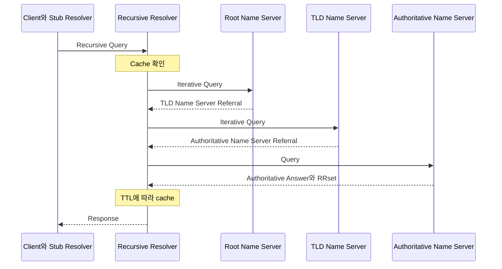
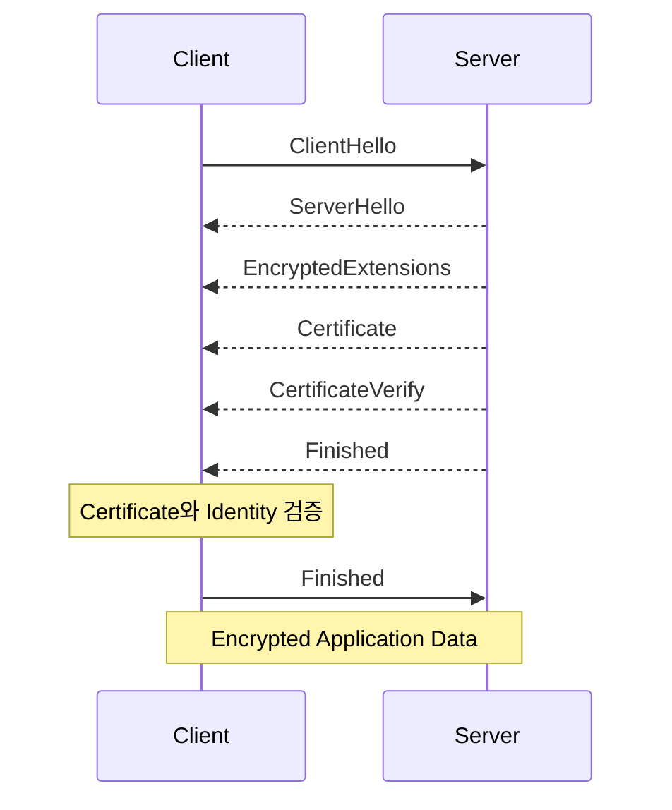

# DNS, HTTPS, Proxy, Load Balancer

## 학습 목표

- DNS의 계층 구조와 recursive resolution 과정을 설명할 수 있다.
- DNS cache와 TTL, negative caching이 성능과 장애 전파에 미치는 영향을 설명할 수 있다.
- HTTPS에서 TLS가 제공하는 보안 속성과 TLS 1.3 Handshake의 역할을 설명할 수 있다.
- 인증 경로 검증과 서비스 identity 검증을 구분할 수 있다.
- Forward Proxy와 Reverse Proxy가 각각 누구를 대신하는지 설명할 수 있다.
- L4와 L7 Load Balancer가 어떤 정보를 기준으로 트래픽을 분산하는지 설명할 수 있다.
- URL 요청이 Backend에 도달하지 못했을 때 DNS부터 Backend까지 계층별로 진단할 수 있다.

## 전체 요청 흐름

<!--
아래 흐름은 대표적인 예시다.

주의:
- hosts file과 브라우저·OS cache는 DNS 서버 계층이 아니라, DNS 질의 전후에 관여하는
  client-side name resolution 과정이다.
- HTTP/1.1과 HTTP/2는 일반적으로 TCP 위에서 TLS를 사용한다.
- HTTP/3는 QUIC 위에서 동작하며, TLS 1.3 Handshake가 QUIC 연결 과정에 통합된다.
- CDN, WAF, Load Balancer, Reverse Proxy는 없을 수도 있고 여러 개일 수도 있다.
- 하나의 제품이나 프로세스가 Load Balancer와 Reverse Proxy 역할을 함께 수행할 수도 있다.

작성할 내용:
1. URL을 scheme, authority, path, query 등으로 해석하는 단계
2. local name resolution과 recursive DNS resolution의 구분
3. HTTP version에 따른 transport 및 TLS 연결 차이
4. intermediary가 0개 이상 존재할 수 있다는 점
5. Backend 이후 application, cache, DB 호출은 이번 범위에서 어디까지 다룰지
-->

```text
URL 해석
→ Local Name Resolution
  ├─ Browser와 Application Cache
  ├─ OS Cache
  └─ hosts file
→ Recursive DNS Resolution
→ 대상 IP 선택
→ 연결 수립
  ├─ HTTP/1.1·HTTP/2: TCP → TLS
  └─ HTTP/3: QUIC + TLS 1.3
→ HTTP 요청
→ CDN, WAF, Load Balancer, Reverse Proxy (0개 이상)
→ Backend
```

## DNS

- DNS(Domain Name System)는 Domain Name과 Resource Record를 관리하고 조회하기 위한 계층적·분산형 naming system이자 query-response protocol이다.
- DNS에 저장된 정보는 여러 authoritative server에 분산되어 있으며, domain namespace의 관리 권한은 zone 단위로 위임된다.

### DNS의 역할

<!--
DNS를 단순히 "Domain Name을 IP 주소로 변환하는 시스템"이라고만 정의하지 않는다.

작성할 내용:
- 계층적으로 관리되는 distributed database이자 query-response protocol이라는 점
- Domain Name에 연결된 Resource Record를 조회한다는 점
- A와 AAAA는 가능한 결과 중 일부이며, MX·NS·TXT 등 IP가 아닌 정보도 반환한다는 점
- namespace, zone, delegation의 관계
- authoritative data와 cached data의 차이
-->

DNS는 domain name(`example.com`)을 연결된 Resource Record를 조회한다.

A와 AAAA Record를 이용해 Domain Name에 대응하는 IPv4와 IPv6 주소를 조회할 수 있으며, 그 밖에도 mail server를 나타내는 MX, authoritative name server를 나타내는 NS, 문자열 정보를 저장하는 TXT 등 다양한 정보를 조회할 수 있다.

Domain Name에 연결된 정보를 찾는 전체 과정을 DNS resolution이라고 한다. DNS resolution 과정에서 resolver는 질의한 Domain Name과 Record Type에 해당하는 RRset을 찾는다.


### DNS 구성 요소

<!--
각 구성 요소가 "누구에게 질의하고 어떤 형태로 응답하는지"를 중심으로 작성한다.

- Stub Resolver
- Recursive Resolver
- Root Name Server
- TLD Name Server
- Authoritative Name Server
- Zone
- Delegation
- Referral
-->


Domain Name은 오른쪽에서 왼쪽으로 Root(.) → TLD(com) → 하위 Domain(google) 순으로 계층을 구분할 수 있다.

유저가 브라우저에 주소를 입력하면, 브라우저 캐시에 없는 경우 recursive server로 질의를 시도한다.
recursive server에 캐시가 없는 경우 DNS 계층에 따라 하위 dns 계층으로 쿼리해 A와 AAAA 레코드에서 IP 주소 등 리소스를 찾는다.

- Stub Resolver : Client 측에서 DNS 질의를 시작하는 간단한 resolver
   - 사용자로부터 요청 받아서 recursive resolver로 전달

- Recursive Resolver : Client를 대신해 DNS resolution을 수행하는 server.
   - 보통 ISP사, 서드파티 DNS 프로바이더에 의해 관리
   - 질의 결과를 Resource Record의 TTL에 따라 cache
   - 요청 들어오면 캐시 확인 > 결과 없으면 하위 Name Server에 iterative query
- Authoritative Name Server 
   - 자신이 관리하는 zone의 authoritative data에 대한 질의에 응답한다.
   - 하위 zone으로 관리 권한이 delegation된 경우 해당 zone의 Name Server 정보를 referral로 반환할 수 있다.
   - Root Name Server : 최상위에 위치, 루트 존. TLD 서버로 referrral 반환
   - TLD Name Server : 해당 TLD 하위 계층 zone name server 정보의 referrral 반환

- Referral : 현재 server가 최종 answer 대신 하위 계층의 Authoritative Name Server 정보를 반환하는 응답

### DNS 조회 과정

<!--
아래 다이어그램은 recursive resolver가 cache miss인 경우 iterative query를 수행하는
대표적인 흐름이다.

작성할 내용:
1. Client의 stub resolver가 recursive resolver에 recursive query를 전달
2. Recursive resolver가 cache를 먼저 확인
3. Cache miss이면 root → TLD → authoritative server 순으로 iterative query 수행
4. Referral에는 다음으로 질의할 name server 정보가 포함될 수 있음
5. 최종 RRset을 TTL과 함께 cache한 뒤 client에 반환
6. CNAME이 있으면 추가 조회가 발생할 수 있음
7. 실제 구현에서는 QNAME minimization, DNSSEC, forwarding 등으로 흐름이 달라질 수 있음
-->



### 주요 DNS Resource Record(RR)

<!--
Record의 "owner name, TTL, class, type, RDATA" 구조를 먼저 설명한 뒤 표를 작성한다.

주의:
- CNAME은 "다른 domain의 IP를 복사하는 record"가 아니라 owner name을 canonical name의
  alias로 만드는 record다.
- NS는 zone의 authoritative name server를 지정한다.
- MX의 preference 값은 숫자가 작을수록 우선순위가 높다.
- TXT는 임의의 문자열을 저장하지만, 실제 사용 방식은 상위 protocol별 규칙에 따른다.
- AAAA 정의는 RFC 3596을 참고한다.
-->

- A: Domain Name에 IPv4 주소 연결
- AAAA: Domain Name에 IPv6 주소 연결
- CNAME: 다른 Domain Name을 canonical name의 alias로 지정
- NS: Zone의 Authoritative Name Server 지정
- MX: Domain의 Mail Exchange Server 지정
- TXT: Domain과 연관된 문자열 정보 저장

### DNS Cache와 TTL

<!--
작성할 내용:
- TTL은 RR을 cache에서 재사용할 수 있는 시간
- TTL이 길 때: cache hit 증가, authoritative query 감소, 변경 반영 지연
- TTL이 짧을 때: 변경 반영 속도 증가, resolver와 authoritative server 부하 증가
- authoritative server에서 TTL을 바꿔도 이미 cache된 응답의 남은 TTL은 즉시 사라지지 않음
- 장애 전환 전에 TTL을 미리 낮추는 이유
- browser, OS, recursive resolver 등이 각각 cache할 수 있다는 점
- 실제 cache 정책이 RFC TTL과 완전히 동일하지 않을 수 있는 구현 차이
-->

- TTL: RR을 cache에서 재사용할 수 있는 시간
   - Resolver는 TTL이 남아 있는 동안 cached RR을 재사용할 수 있다.
   - TTL이 만료되면 해당 RR을 버리고 다시 DNS 조회를 수행한다.
   - TTL이 0인 RR은 현재 transaction에서만 사용하고 cache하지 않는다.
   - TTL이 긴 경우: 
      - Cache hit 증가 DNS query 수 감소
      - DNS Record가 변경되었을 때 이전 값이 오래 유지될 수 있음
   - TTL이 짧은 경우:
      - DNS Record 변경 사항이 비교적 빠르게 반영
      - cache miss와 DNS query가 증가 → resolver와 authoritative server의 부하가 커질 수 있다.

DNS cache를 사용하면 동일 Domain에 대해 매번 Authoritative Name Server까지 조회하지 않아도 되므로 DNS 조회 latency와 upstream DNS server의 부하를 줄일 수 있다.

이미 cache된 RR은 남아 있는 TTL 동안 사용될 수 있기 때문에 Authoritative Name Server에서 Record나 TTL을 변경해도 기존 cache가 즉시 사라지는 것은 아니다.
따라서 server 이전이나 장애 전환처럼 DNS Record 변경이 예정된 경우에는 기존 cache가 먼저 만료될 수 있도록 변경 전에 TTL을 낮춰 두기도 한다.

DNS cache는 Recursive Resolver뿐 아니라 Browser나 OS 등에서도 구현될 수 있으며, 세부적인 cache 정책은 구현에 따라 달라질 수 있다.

### Negative Caching

<!--
다음 세 종류를 구분한다.

1. NXDOMAIN
   - 질의한 domain name 자체가 존재하지 않음
2. NODATA
   - domain name은 존재하지만 요청한 RR type의 data가 없음
3. Resolution Failure
   - SERVFAIL, timeout, unreachable server 등으로 유용한 응답을 얻지 못함

작성할 내용:
- NXDOMAIN과 NODATA negative response의 TTL이 SOA와 어떤 관계가 있는지
- 실패 결과를 cache하지 않으면 반복 질의가 장애를 증폭할 수 있는 이유
- RFC 9520에서 resolution failure caching을 요구하는 이유
-->

DNS에서는 정상적으로 조회된 Resource Record뿐 아니라, "해당 정보이 존재하지 않는다"는 응답이나 DNS resolution 자체가 실패했다는 결과도 일정 시간 cache할 수 있다.

Negative response는 크게 다음과 같이 구분할 수 있다.

- `NXDOMAIN`
   : 질의한 Domain Name 자체가 존재하지 않는 경우
- `NODATA`
   : Domain Name은 존재하지만 요청한 Record Type의 데이터가 없는 경우
   - e.g. example.com은 존재하지만 AAAA Record가 없는 경우
- Resolution Failure
   : Resolver가 유용한 DNS 응답을 얻지 못한 경우
   - e.g. SERVFAIL, timeout, unreachable server, DNSSEC validation failure 등

### DNS 진단

```bash
# 기본 조회: status, flags, answer, authority, 응답 resolver 확인
dig google.com A

; <<>> DiG 9.10.6 <<>> google.com A
;; global options: +cmd
;; Got answer:
;; ->>HEADER<<- opcode: QUERY, status: NOERROR, id: 20616
;; flags: qr rd ra; QUERY: 1, ANSWER: 1, AUTHORITY: 0, ADDITIONAL: 1

;; OPT PSEUDOSECTION:
; EDNS: version: 0, flags:; udp: 512
;; QUESTION SECTION:
;google.com.                    IN      A

;; ANSWER SECTION:
google.com.             220     IN      A       142.250.198.142

;; Query time: 9 msec
;; SERVER: 203.248.252.2#53(203.248.252.2)
;; WHEN: Fri Aug 07 16:40:05 KST 2026
;; MSG SIZE  rcvd: 55

# 특정 recursive resolver와 결과 비교
dig @1.1.1.1 google.com

; <<>> DiG 9.10.6 <<>> @1.1.1.1 google.com
; (1 server found)
;; global options: +cmd
;; Got answer:
;; ->>HEADER<<- opcode: QUERY, status: NOERROR, id: 49808
;; flags: qr rd ra; QUERY: 1, ANSWER: 6, AUTHORITY: 0, ADDITIONAL: 1

;; OPT PSEUDOSECTION:
; EDNS: version: 0, flags:; udp: 1232
;; QUESTION SECTION:
;google.com.                    IN      A

;; ANSWER SECTION:
google.com.             35      IN      A       172.217.211.113
google.com.             35      IN      A       172.217.211.100
google.com.             35      IN      A       172.217.211.138
google.com.             35      IN      A       172.217.211.101
google.com.             35      IN      A       172.217.211.139
google.com.             35      IN      A       172.217.211.102

;; Query time: 10 msec
;; SERVER: 1.1.1.1#53(1.1.1.1)
;; WHEN: Fri Aug 07 16:28:23 KST 2026
;; MSG SIZE  rcvd: 135

# 간단한 이름 조회
nslookup google.com
Server:         203.248.252.2
Address:        203.248.252.2#53

Non-authoritative answer:
Name:   google.com
Address: 142.250.198.46
```

위 결과에서 기본 DNS Resolver(`203.248.252.2`)와 Cloudflare Resolver(`1.1.1.1`)가 서로 다른 A Record와 TTL을 반환했다.

```text
기본 Resolver
google.com.  220  IN A 142.250.198.142

Cloudflare
google.com.   35  IN A 172.217.211.100
...
```

DNS 조회 결과는 Recursive Resolver의 cache 상태나 질의 시점, Authoritative DNS의 응답 정책 등에 따라 서로 다를 수 있으므로, Resolver마다 다른 IP가 반환된 것만으로 DNS 장애라고 판단할 수는 없다.

두 `dig` 결과 모두 `status: NOERROR`이고 `rd ra` flag가 존재하므로, Recursive Resolver에 recursion을 요청했고 해당 Resolver가 정상적으로 recursive query를 처리해 Answer를 반환한 것을 확인할 수 있다.

또한 `aa` flag가 없으므로 현재 결과는 Google의 Authoritative Name Server에 직접 질의하여 받은 authoritative answer가 아니라 Recursive Resolver를 통해 얻은 응답이다.


| 항목 | 의미   | 장애 시 확인할 내용 |
| --- | ----- | --------------- |
| `status`     | DNS 응답의 결과 코드(RCODE) `NOERROR`, `NXDOMAIN`, `SERVFAIL`, `REFUSED` 등 | 이름이 없는지(`NXDOMAIN`), resolution 과정에서 실패했는지(`SERVFAIL`), server가 질의를 거부했는지(`REFUSED`) 확인 |
| `aa`         | Authoritative Answer. 응답한 Name Server가 질의한 이름에 대해 authoritative한 응답을 했음을 의미 | Authoritative Server에 직접 질의했는데 `aa`가 없는지, 현재 응답이 authoritative data인지 cache를 통한 응답인지 확인 |
| `rd`와 `ra` | `rd`: client가 recursion을 요청, `ra`: 응답 server가 recursion 기능을 제공 | Recursive Resolver에 질의했는데 `ra`가 없는지, Authoritative Server에 직접 질의한 상황인지 확인 |
| `ANSWER`     | 질의에 직접 답하는 Resource Record가 포함되는 section| 원하는 A, AAAA, CNAME 등이 존재하는지, 예상한 값인지, TTL이 남아 있는지, CNAME chain이 정상인지 확인|
| `AUTHORITY`  | 질의와 관련된 authoritative 정보를 담는 section| Delegation에서는 다음 Authoritative Name Server의 NS Record를, negative response에서는 SOA Record 등을 확인|
| `ADDITIONAL` | Answer나 Authority 처리를 돕는 추가 Resource Record를 담는 section | NS의 주소를 제공하는 glue A와 AAAA Record 등이 필요한 상황에서 존재하는지 확인. `dig`에서는 EDNS의 OPT pseudo-record도 별도로 표시될 수 있음 |
| `SERVER`     | 실제로 `dig` 질의에 응답한 DNS  | 의도한 Recursive 또는 Authoritative Server에 질의했는지 확인 |
| `Query time` | `dig`가 측정한 DNS query의 요청-응답 소요 시간 | 평소보다 응답 시간이 긴지, 특정 Resolver에서만 지연되는지 비교 |


## HTTP와 HTTPS

<!--
HTTP와 HTTPS를 완전히 다른 application protocol로 설명하지 않는다.

작성할 내용:
- HTTP는 application-level semantics를 정의
- `https` URI는 HTTP 통신을 TLS로 보호하고 서버 identity를 검증할 것을 요구
- TLS가 HTTP method, status code, header 의미를 정의하는 것은 아님
- HTTPS가 application 자체의 취약점이나 endpoint 침해까지 해결하지는 않음
-->

HTTP는 application-level request와 response의 의미를 정의하는 protocol이며, HTTPS는 HTTP 통신을 TLS로 보호하는 방식이다.

TLS는 HTTP Method나 Status Code의 의미를 바꾸는 것이 아니라, Client와 Server 사이의 통신에 **기밀성(confidentiality), 무결성(integrity), peer authentication**을 제공한다.

| 구분 | HTTP | HTTPS |
| ---- | ---- | ----- |
| 전송 구간 보호 | 기본적으로 없음 | TLS를 통해 암호화·무결성 보호 |
| 서버 identity 검증 | 기본적으로 없음 | 인증서 검증을 통해 수행 |
| URL Scheme | `http` | `https` |
| 기본 Port | 80 | 443 |
| HTTP semantics | 동일 | 동일 |

### 대칭키, 비대칭키

- **대칭키 암호화**
  - 동일한 secret key를 이용해 데이터를 암호화·복호화한다.
  - 연산 비용이 비교적 낮아 실제 Application Data 보호에 적합하다.
  - 통신 전에 양쪽이 같은 key를 안전하게 공유해야 한다는 문제가 있다.

- **비대칭키 암호화**
  - 서로 다른 Public Key와 Private Key를 사용한다.
  - Private Key로 만든 digital signature를 대응하는 Public Key로 검증하여 상대가 Private Key를 보유하고 있음을 확인할 수 있다.
  - 대칭키 암호화보다 연산 비용이 크기 때문에 TLS에서는 Application Data 전체를 비대칭키로 암호화하지 않는다.

TLS 1.3에서는 일반적으로 (EC)DHE 기반 key agreement로 shared secret을 만들고, 인증서와 digital signature를 이용해 Server를 인증한다. 이후 이 secret에서 파생한 대칭키를 이용해 Application Data를 보호한다.

### TLS 1.3 Full Handshake



- **ClientHello**
  - 지원하는 TLS Version, Cipher Suite, Key Share, SNI, ALPN 등의 정보를 전달한다.
- **ServerHello**
  - 사용할 TLS Version, Cipher Suite와 Server의 Key Share를 선택하여 전달한다.
- **EncryptedExtensions**
  - ServerHello에 포함되지 않은 나머지 handshake parameter를 전달한다.
- **Certificate**
  - Server의 인증서와 필요한 인증서 체인을 Client에 전달한다.
- **CertificateVerify**
  - Server가 인증서의 Public Key에 대응하는 Private Key를 실제로 보유하고 있음을 signature로 증명한다.
- **Finished**
  - 지금까지의 Handshake 내용과 계산된 key가 일치하는지 검증하여 Handshake가 변조되지 않았음을 확인한다.

TLS 1.3의 일반적인 Full Handshake에서는 Server의 `Finished`가 먼저 전달되고 Client가 이를 검증한 뒤 자신의 `Finished`를 전달한다.

### 인증서의 역할과 인증서 체인

인증서는 Server의 identity와 Public Key 등의 정보를 CA의 digital signature로 묶은 문서이다.

Client는 인증서를 통해 다음을 확인한다.

1. 인증서가 신뢰할 수 있는 CA 체인으로 연결되는가
2. 인증서가 현재 유효한 기간 내에 있는가
3. 접속하려는 hostname이 인증서의 SAN과 일치하는가
4. Server가 해당 인증서의 Public Key에 대응하는 Private Key를 실제로 보유하고 있는가

```text
Trust Anchor (Root CA)
└── Intermediate CA
    └── End-Entity 또는 Server Certificate
```

Server는 일반적으로 자신의 Server Certificate와 필요한 Intermediate CA Certificate를 전달한다. Root CA는 보통 Client의 Trust Store에 저장된 Trust Anchor를 사용한다.

따라서 **인증서 체인을 신뢰할 수 있는지 확인하는 것**과 **현재 접속한 hostname이 인증서와 일치하는지 확인하는 것**은 서로 다른 검증 과정이다.

## Proxy

Proxy는 Client와 Server 사이에서 요청이나 connection을 중계하는 intermediary이다.

### Forward Proxy

Forward Proxy는 **Client 측을 대신해 외부 Server에 요청하는 Proxy**이다.

```text
Client → Forward Proxy → Origin Server
```

Origin Server 입장에서는 Client 대신 Forward Proxy가 직접 통신하는 peer가 된다.

주요 사용 사례:

- 외부 접근 제어
- 요청 filtering
- egress 관리
- caching

### Reverse Proxy

Reverse Proxy는 **Server 측을 대신해 Client의 요청을 받아 내부 Backend로 전달하는 Proxy**이다.

```text
Client → Reverse Proxy 또는 Gateway → Backend
```

Client에게는 Reverse Proxy가 Origin Server처럼 보일 수 있다.

주요 사용 사례:

- Host와 Path 기반 routing
- TLS termination
- caching
- authentication
- Load Balancing

Reverse Proxy와 Load Balancer는 항상 별도의 장비를 의미하지 않는다. 하나의 제품이 두 역할을 함께 수행할 수 있다.

| 구분 | Forward Proxy | Reverse Proxy |
| ---- | ------------- | ------------- |
| 대리하는 측 | Client | Server 또는 Backend |
| 누가 주로 설정하는가 | Client 또는 Client 측 Network | Server 운영 측 |
| 외부에서 숨겨지는 측 | Client | Backend Server |
| 주요 목적 | 접근 제어, egress, filtering | routing, TLS termination, backend 보호 |
| 대표 사례 | 사내 Web Proxy | NGINX, HAProxy, Application Load Balancer |

### Proxy 사용 시 전달 정보

Reverse Proxy가 Backend에 새로운 connection을 만들면 Backend에서는 원래 Client의 IP나 scheme을 직접 알 수 없을 수 있다. 이를 전달하기 위해 `Forwarded` 또는 `X-Forwarded-*` 계열 header를 사용할 수 있다.

```http
Forwarded: for=192.0.2.60;proto=https;host=example.com
X-Forwarded-For: 192.0.2.60, 198.51.100.10
X-Forwarded-Proto: https
X-Forwarded-Host: example.com
```

| Header | 전달하려는 원본 정보 | 보안상 주의점 |
| ------ | --------------------- | ------------- |
| `Host` | 요청 대상 Host | Proxy가 Backend용 Host로 변경할 수 있음 |
| `Forwarded` | Client IP, Proxy, Host, Protocol | Client가 임의로 보낼 수 있으므로 신뢰하는 Proxy가 만든 값만 사용 |
| `X-Forwarded-For` | 원래 Client IP와 거친 Proxy 목록 | 외부 입력을 무조건 신뢰하면 IP spoofing 가능 |
| `X-Forwarded-Proto` | 원래 요청의 `http` 또는 `https` scheme | Redirect URL이나 secure-cookie 판단 등에 사용되므로 신뢰 경계 필요 |
| `X-Forwarded-Host` | 원래 요청 Host | Host 기반 URL 생성 시 신뢰 경계 필요 |

Application은 Client가 직접 보낸 `Forwarded` 또는 `X-Forwarded-*` 값을 무조건 신뢰해서는 안 된다. 신뢰하는 Proxy가 값을 제거하거나 정규화한 뒤 전달하도록 구성하고, Application도 신뢰할 Proxy 범위를 지정해야 한다.

## Load Balancer

### Load Balancer의 역할

Load Balancer는 하나의 Service Endpoint로 들어온 traffic을 여러 Backend Target에 분산한다.

이를 통해 다음을 지원할 수 있다.

- 여러 Backend로 traffic 분산
- Scale-out
- Backend 장애 시 정상 Target으로 traffic 전달
- 배포·점검 중 특정 Target 제외

Load Balancer는 Health Check를 통해 Target의 상태를 확인하고, unhealthy하다고 판단된 Target에는 일반적으로 새로운 traffic을 전달하지 않는다.

### L4 vs L7 Load Balancer

L4 Load Balancer는 Transport Layer의 connection 또는 flow 정보를 중심으로 Target을 선택하고, L7 Load Balancer는 HTTP와 같은 Application Protocol의 내용을 이해하여 request 단위 routing을 수행할 수 있다.

| 구분 | L4 Load Balancer | L7 Load Balancer |
| ---- | ---------------- | ---------------- |
| 주요 판단 기준 | IP, Port, Transport Protocol, Flow | Host, Path, Header, Method 등 Application Data |
| 이해하는 Protocol | TCP, UDP 등 | HTTP, HTTPS 등 |
| Routing 단위 | Connection 또는 Flow | Request |
| HTTP Host와 Path Routing | 불가 | 가능 |
| TLS 처리 | 제품에 따라 passthrough 또는 termination | 일반적으로 HTTP 내용을 확인하려면 TLS termination 필요 |
| 장점 | Protocol 의존성이 낮고 높은 처리량에 적합 | 세밀한 HTTP Routing과 Application 기능 제공 |
| 고려 사항 | HTTP 내용에 따른 Routing 불가 | Application parsing과 TLS termination 등에 따른 추가 처리 |

L4 Load Balancer라고 해서 TLS를 절대 처리하지 않는 것은 아니다. 예를 들어 AWS Network Load Balancer는 TCP뿐 아니라 TLS Listener도 지원한다.

### 부하 분산 방식

| 방식 | 선택 기준 | 적합한 상황 | 고려 사항 |
| ---- | --------- | ----------- | --------- |
| Round Robin | Target을 순서대로 선택 | 처리 시간이 대체로 비슷한 요청 | Long-lived connection이나 Target 처리량 차이가 크면 불균형 가능 |
| Least Connections | 현재 Connection이 가장 적은 Target 선택 | Connection 유지 시간이 제각각인 경우 | Connection 수가 실제 처리 부하와 항상 일치하지는 않음 |
| Hash 기반 | Client IP나 Key의 Hash 값으로 Target 선택 | 동일 Client를 같은 Target에 보내고 싶은 경우 | Target 구성이 바뀌면 mapping이 달라질 수 있음 |

제품마다 지원하는 알고리즘과 정확한 동작은 다를 수 있다. 예를 들어 AWS ALB의 `least_outstanding_requests`는 일반적인 `least_connections`와 동일한 알고리즘이 아니다.

### Health Check

Load Balancer는 Backend가 요청을 처리할 수 있는지 확인하기 위해 주기적으로 Health Check를 수행할 수 있다.

주요 설정은 다음과 같다.

| 설정 | 의미 | 설정 시 고려 사항 |
| ---- | ---- | ----------------- |
| Interval | Health Check 수행 간격 | 짧으면 장애 감지가 빨라지지만 check traffic 증가 |
| Timeout | 응답을 기다리는 최대 시간 | 너무 짧으면 일시적인 지연을 장애로 판단할 수 있음 |
| Healthy Threshold | Healthy로 복귀하기 위한 연속 성공 횟수 | 높을수록 복구 판단이 느려짐 |
| Unhealthy Threshold | Unhealthy로 판단하기 위한 연속 실패 횟수 | 낮을수록 장애 감지는 빠르지만 일시적 오류에 민감 |
| Success Code | 정상으로 판단할 HTTP Status 범위 | Application의 Health Endpoint 동작과 맞아야 함 |

Load Balancer의 Health Check와 Kubernetes의 Probe는 목적이 비슷해 보일 수 있지만 동일한 개념은 아니다.

- `readinessProbe`: Pod가 Service traffic을 받을 준비가 되었는지 판단
- `livenessProbe`: Container를 재시작해야 하는지 판단
- `startupProbe`: 느린 시작 과정에서 liveness와 readiness가 너무 빨리 실행되는 것을 방지


## 참고 자료

### DNS 표준 및 Registry

- [DNS-TERM] [RFC 9499: DNS Terminology](https://www.rfc-editor.org/info/rfc9499/)
- [DNS-CONCEPT] [RFC 1034: Domain Names — Concepts and Facilities](https://www.rfc-editor.org/info/rfc1034/)
- [DNS-IMPL] [RFC 1035: Domain Names — Implementation and Specification](https://www.rfc-editor.org/info/rfc1035/)
- [DNS-IPV6] [RFC 3596: DNS Extensions to Support IP Version 6](https://www.rfc-editor.org/info/rfc3596/)
- [DNS-NCACHE] [RFC 2308: Negative Caching of DNS Queries](https://www.rfc-editor.org/info/rfc2308/)
- [DNS-FAILCACHE] [RFC 9520: Negative Caching of DNS Resolution Failures](https://www.rfc-editor.org/info/rfc9520/)
- [DNS-IANA] [IANA: Domain Name System Parameters](https://www.iana.org/assignments/dns-parameters/dns-parameters.xhtml)
- [BIND-DIG] [BIND 9 Manual Pages](https://bind9.readthedocs.io/en/stable/manpages.html)

### HTTP, TLS, QUIC 및 인증서

- [HTTP-SEMANTICS] [RFC 9110: HTTP Semantics](https://www.rfc-editor.org/info/rfc9110/)
- [TLS13] [RFC 9846: The Transport Layer Security Protocol Version 1.3](https://www.rfc-editor.org/info/rfc9846/)
- [TLS13-TRACE] [RFC 8448: Example Handshake Traces for TLS 1.3](https://www.rfc-editor.org/info/rfc8448/)
- [TLS-DEPLOY] [RFC 9325: Recommendations for Secure Use of TLS and DTLS](https://www.rfc-editor.org/info/rfc9325/)
- [TLS-SNI] [RFC 6066: TLS Extensions — Server Name Indication](https://www.rfc-editor.org/info/rfc6066/)
- [TLS-ALPN] [RFC 7301: TLS Application-Layer Protocol Negotiation](https://www.rfc-editor.org/info/rfc7301/)
- [QUIC-TLS] [RFC 9001: Using TLS to Secure QUIC](https://www.rfc-editor.org/info/rfc9001/)
- [HTTP3] [RFC 9114: HTTP/3](https://www.rfc-editor.org/info/rfc9114/)
- [PKIX] [RFC 5280: Internet X.509 PKI Certificate and CRL Profile](https://www.rfc-editor.org/info/rfc5280/)
- [TLS-ID] [RFC 9525: Service Identity in TLS](https://www.rfc-editor.org/info/rfc9525/)
- [OCSP] [RFC 6960: Online Certificate Status Protocol](https://www.rfc-editor.org/info/rfc6960/)
- [OPENSSL-SCLIENT] [OpenSSL `s_client` Documentation](https://docs.openssl.org/3.5/man1/openssl-s_client/)
- [CURL] [curl Command-Line Manual](https://curl.se/docs/manpage.html)

### Proxy 및 Load Balancer

- [FORWARDED] [RFC 7239: Forwarded HTTP Extension](https://www.rfc-editor.org/info/rfc7239/)
- [NGINX-PROXY] [NGINX `ngx_http_proxy_module`](https://nginx.org/en/docs/http/ngx_http_proxy_module.html)
- [NGINX-UPSTREAM] [NGINX `ngx_http_upstream_module`](https://nginx.org/en/docs/http/ngx_http_upstream_module.html)
- [AWS-NLB] [AWS: What is a Network Load Balancer?](https://docs.aws.amazon.com/elasticloadbalancing/latest/network/introduction.html)
- [AWS-ALB] [AWS: What is an Application Load Balancer?](https://docs.aws.amazon.com/elasticloadbalancing/latest/application/introduction.html)
- [AWS-ALB-HC] [AWS: Health Checks for Application Load Balancer Target Groups](https://docs.aws.amazon.com/elasticloadbalancing/latest/application/target-group-health-checks.html)
- [AWS-NLB-HC] [AWS: Health Checks for Network Load Balancer Target Groups](https://docs.aws.amazon.com/elasticloadbalancing/latest/network/target-group-health-checks.html)
- [AWS-ALB-TG] [AWS: Application Load Balancer Target Group Attributes](https://docs.aws.amazon.com/elasticloadbalancing/latest/application/edit-target-group-attributes.html)
- [K8S-PROBES] [Kubernetes: Configure Liveness, Readiness and Startup Probes](https://kubernetes.io/docs/tasks/configure-pod-container/configure-liveness-readiness-startup-probes/)


## 함께 읽기

- [3주차 - DNS, TLS, Proxy, Load Balancer 트러블슈팅 사례](03_Resource/04_network/06_dns_tls_proxy_lb_ts)
- [2주차 - HTTP와 요청 및 응답](03_Resource/04_network/03_http)
